<!-- _paginate: skip -->

# 汇报

## 七个步骤变身汇报达人
（职场汇报系列）

---

# 1 概述
## 1.1 前言
汇报这个技能不仅常用，而且非常重要。
有些汇报结果，可以决定我们的职业前途。比方说：
1. 转正答辩
2. 年终述职
3. 解决方案介绍
4. 项目进展汇报
...

---

# 1 概述
## 1.2 关于汇报的两个问题
在讲之前，我们先搞清楚两个问题：

### 问题1：为什么职场人总是要汇报？
汇报是为了提高听众获取信息的效率。
这里的听众，你可以理解成你的老板，或者是你的客户，也就是你要汇报的对象

### 问题2：汇报的本质究竟是什么？
说到底，汇报就是沟通的一种形式。
沟通，除了传递信息，更重要的是要影响听的人

---
# 1 概述
## 1.3 好的汇报的两个标准

### 标准1：让听众获取信息效率越高的汇报，就是越好的汇报
好的汇报，它能让听众愿意听，记得住，好理解。

### 标准2：对听众产生影响越大的汇报就是越好的汇报
好的汇报，它能改变听众的观点、态度和行为。

---
# 1 概述
## 1.4 做好汇报的3个阶段、7个步骤
|汇报阶段|步骤内容|
|---|---|
|汇报前| （1）设计目标   （2）分析听众    （3）设计框架   （4）充实内容   （5）调整优化|
|汇报中|（6）从容演绎|
|汇报后| （7）复盘回顾|

---
# 2 汇报前-设计目标
很多人准备汇报，第一步就去找PPT模版，或者直接套用曾经使用过的模版。
这样做往往至少有两个隐患：
### 隐患1：本末倒置
汇报是一种特殊的沟通形式，其本质上是影响听众的一个机会，所以想清楚如何更好的影响听众，远远比你比写一份汇报材料更重要。套用模版会让你直接进入写PPT的过程，减弱了重要的思考过程。
要注意，PPT只是辅助我们影响听众的工具而已，并不是汇报本身。
### 隐患2：限制思路
模板中自带的结构不一定适合你本次的汇报。
一旦我们认可了模版中的结构，就很难再从模版中的思路跳出来。
**准备汇报的第一步应该是想清楚为什么要做这次汇报，汇报的目标究竟是什么？**

---

# 2 汇报前-设计目标
## 2.1 如何设定目标？
明确汇报的目标就是要明确影响听众到什么程度。
|影响前A状态|影响后B状态|
|---|---|
|毫不知情|非常清楚|
|影充满疑虑|充满信心|
|充满抵触|积极行动|

设定汇报目标的句式：**这次汇报要让【WHO】【采取WHAT行动】**
重点是既要有听众是谁，又要有听众状态变化的程度

---
# 2 汇报前-设计目标
## 2.2 好的汇报目标的细节
好的汇报目标，有两个细节是一定要注意到的：
### 细节一：我们要影响的听众究竟是谁？
可以参考一个判断原则，**要关注对汇报目标影响最大的听众。**
那这是不是意味着只要关注职位最高、权力最大的听众就好了呢？
答案是看情况，具体问题要具体分析。
关注会对结果产生影响的听众真的很重要。

---
# 2 汇报前-设计目标
### 细节二：目标达成的潜在条件是什么？
目标达成的潜在条件是你能为听众提供什么价值，能让他满足自身利益的前提下满足你的利益。
|设置的目标案例|潜在条件进一步明确|
|---|---|
|这次汇报要让**客户的总经理**了解我们的解决方案。|让客户的总经理了解我们的解决方案，能解决他们的什么问题。|
|这次汇报要让**直属经理**批准我通过试用期|要让数值经理相信我未来能为公司和团队带来价值|
|这次汇报要让**董事长**为新项目追加300万的预算|要让董事长理解追加300万预算之后，这个项目能为公司带来更大的回报。|

---
# 2 汇报前-设计目标
 当然，听众的价值诉求可能不止一个，在分析目标的时候，我们应该尽量都识别出来，并按重要性排序，优先关注听众最关心的价值诉求，
 **听众关心的价值，我们分析的越清楚，我们离目标达成就越近。**

 认真考虑这两个细节之后，设定出来的汇报目标才是一个离汇报成功最近的靶心。
 我们可以把设定出来的目标贴在一个最显眼的地方，在你准备汇报材料的过程中，时不时地看一看。

 当然在分析听众的价值诉求时，你可能会发现，一个最大的障碍就是你对听众毫不了解，那我们应该如何去了解听众，分析听众，让汇报更好的影响听众呢，那就是下一个步骤了。

 ---
 # 3 汇报前-分析听众
前面一直有强调，汇报本质上是影响听众的一个机会，要做到影响听众，前提就是了解听众。
但听汇报的不是领导就是客户，大多数情况下，他都不会给我们问清楚的机会。那没法直接询问听众，那我们又该怎么分析听众呢。
那就是猜，或者说**推断**。
本质上就是：**要基于有限的信息推测出一个可能得结果。**
而且**信息收集的越全面，结论就越准确。**
类比于互联网平台，互联网平台从来不会直接问你的喜好，但却比你自己还了解你自己。靠的就是想方设法收集你的数据，在后台不停的分析你。

 ---
 # 3 汇报前-分析听众
 ## 3.1 怎样才能把听众分析的清清楚楚呢？
那下面重点介绍一下怎样才能把听众分析的清清楚楚呢？从两个问题入手
### 3.1.1 要收集听众哪些信息？
按照对汇报的影响程度，依次是：
#### 第一类：与汇报主题相关的信息
##### （1）汇报的基本信息。 
1）时间、地点；
2）汇报时长；
3）参会人员；......

 ---
 # 3 汇报前-分析听众
##### （2）需要特别关注的三个点。
1）听众对主题的熟悉程度
了解听众对汇报的主题熟悉程度，才能控制好汇报的信息深度。
如果听众对主题非常熟悉，那么我们可以讲得有深度一下；
如果对主题比较陌生，则最好：a.从基础开始，逐步深入；b.尽量使用一些通俗易懂的语言；c.用生动的例子来讲述观点。
2）听众对主题的立场和态度
听众对主题的立场和态度决定我们汇报的角度。

 ---
 # 3 汇报前-分析听众
 如果听众对汇报主题持支持态度，那么我们可以强调已经取得的成果，未来的发展前景，以强化他们的支持。但是如果他们持的是怀疑态度，甚至是反对态度，那么我们最好：a.准备好应对他们质疑的论据，b.客观地分析可能存在的问题，c.合理地提出解决方案。这样才能改变他们的立场。
 3）听众对主题的期待
 对同一个主题，不同的听众会有不同的期待。
比如说，中高层领导期望听到明确结论和决策依据；那基层领导呢，更关注具体的操作步骤和实施计划；合作伙伴呢，可能更关心合作的机会和利益分配。
所以，在汇报中，只有满足不同听众的听众，他们才可能听我们说话，我们才能影响他们。

 ---
 # 3 汇报前-分析听众
#### 第二类：听众的角色与职责。
听众的关注点往往与他们的角色和指责有关。
比如说，高层管理者会关注公司的战略方向、财务状况和整体业绩，而中层管理者呢，可能更关心部门的运营效率、团队协作和资源分配。搞清楚听众的角色和职责，能很好地帮助我们发现听众的价值诉求。
#### 第三类：听众的个人特征。
1）年龄段
年龄，它不只是一个数字，他能反映出一个人的阅历、喜好和身体情况，不同年龄段的人差异很大。比如，对那些年轻听众，在汇报中使用时尚、活泼的语言，很可能拉进和他们之间的关系；但如果是年长的听众，用这种方式，很可能让他们觉得你不认真、不严肃。年轻听众，他眼神好啊，PPT中的字小一点，问题不大；但年长的听众，PPT中的字最好要大一点，因为他们可能眼神不好，看不清。

 ---
 # 3 汇报前-分析听众
2）性别
性格差异对汇报也有影响。我们都知道，多数女性听众偏感性一点，而多数男性听众偏理性一点，我们就需要针对这种差异，适当的调整汇报材料的感性和理性的比重，怎么调呢？后面的课程会有涉及。
3）思考习惯
听众的思考习惯也会影响汇报的风格，有些人倾向于逻辑分析、理性思考，那么我们的汇报，就需要提供严密的逻辑论证和充分的证据支撑。而有些人呢，可能更注重直觉和情感体验，那么我们的汇报可以通过生动的故事、案例和形象的比喻来引起他们的共鸣。
4）沟通风格
不同的人有不同的沟通风格，有些人喜欢口头交流，有些人更喜欢书面材料，那我就曾碰到过那种喜欢自己看大段文字，有问题就提问，不喜欢听他人讲的听众，所以了解听众的沟通风格，也能让你汇报材料准备的更充分。

 ---
 # 3 汇报前-分析听众
5）禁忌
比方说某些文化和宗教背景的听众，可能对特定的话题和表达方式比较敏感；某些组织呢，有可能有特定的行为规范。 汇报前，最好充分了解这些禁忌，防止汇报内容引起听众的反感，避免功亏一篑。

这三大类信息了解的越详细，越有助于准备汇报。
不过，我们也别太追求完美了，根据一般经验，这么多信息，那总有没办法搞清楚的，这种情况也不用完全担心，**只要搞清楚了最重要的第一类信息，就已经能帮助我们把汇报材料准备到80分了。**

 ---
 # 3 汇报前-分析听众
###  3.1.2 怎么收集这些信息？
#### 方法一：问
这也是最快的方法。不但要问，而且要多问几个人，以消除他们的个人偏见，问谁合适呢？有两类人。
第一类是**比你更了解听众的人**，比如说那些和领导有密切接触的业务骨干，经常和领导一起开会的秘书，与客户合作过的销售人员等等，
第二类是，曾经向同一个听众做过汇报的人。可以问问他们的经验，比如说听众提出过什么问题，他们的回答以及听众的反馈等等，可以从他们的经验中获取有效的信息，帮助我们更好地汇报。

 ---
 # 3 汇报前-分析听众
#### 方法二：观察
平常要多观察，要多留意领导的发言和行为。他们对不同问题的反应，提出过哪些问题，强调过哪些重点等等，都能反映出他们的关注点和思考习惯。 这里举个例子，比如说某个领导在多个场合都强调过创新的重要性，那么创新一定是他最关心的东西。在汇报中，可以突出创新方面的内容。
#### 方法三：查资料
第三个办法：查资料。
公司内部有很多文档资料，比如说，会议纪要，项目报告等等，这些资料，其实就蕴含着领导对特定问题的看法和期待，仔细研究这些资料，能够很好地帮助我们把握汇报的方向。

 ---
 # 3 汇报前-分析听众
#### 方法四：研究组织的战略目标
领导和客户的关注点，通常都跟这个组织的发展方向密切相关。比如说，公司现在正在进行数字化转型，那么跟数字化转型相关的内容，很可能就是领导关注的内容。

请注意，这四个办法是可以组合起来使用的，越重要的汇报，就越要尝试不同的方法来获取更多的信息，这样才有助于我们更好地分析听众。

到这里，分析听众的办法介绍完了，大家可能觉得这太麻烦了，有这种想法也很正常，人嘛都是能省事就省事。
其实呀，**只要开始有意识地收集听众的信息，并尝试从中分析出对汇报有帮助的内容，就已经超过95%的职场人了。**
至于愿不愿意，费点劲儿成为职场中最顶尖的5%，那就看自己个人选择了。

 ---
 # 4 汇报前-设计汇报框架
  ## 4.1 什么是汇报框架？
  简单来说，汇报框架就是汇报中信息的组织方式，也就是搞清楚先讲什么，后讲什么。
  举个例子感受一下。
  上班前，你女朋友，跟你说：我想吃葡萄，你下班了带着葡萄回来，顺便买点牛奶，哦，还有啊，我看看家里是不是没有土豆了，哦，果然没了，接单也没了，都买点吧，你再买点胡萝卜，橘子也买点，含有咸鸭蛋，苹果也买点，再带一盒酸奶。请问，你女朋友让没什么？回忆一下，能回忆出几样？
  那如果你女朋友换个说法：你下班的时候，带九样东西回来，蛋奶类，要买牛奶、酸奶、鸡蛋和咸鸭蛋；水果我要吃橘子、葡萄、苹果。蔬菜买点土豆和胡萝卜。

---
# 4 汇报前-设计汇报框架
在第二个说法下，在回忆下要买哪些东西？是不是发现自己的记忆力突然变好了？
这里就可以看出，同样的信息，用不同的顺序表达，就有完全不一样的效果。

## 4.2 为什么汇报框架很重要？
所以啊，知道先讲什么，后讲什么，能组织好信息的顺序，是一个非常重要的能力。
这里就可以看出，同样的信息，用不同的顺序表达，就有完全不一样的效果。所以啊，知道先讲什么，后讲什么，能组织好信息的顺序，是一个非常重要的能力。

因此，可以看到：
**不同的信息组织顺序，有截然不同的效果。**
**能正确组织信息顺序，是非常重要的能力。**

---
# 4 汇报前-设计汇报框架
## 4.3 怎么设计好汇报框架？
### 4.3.1 使用金字塔原理
早就有人发现了这里面的门道，这个人就是咨询界的老前辈，麦肯锡历史上第一位女咨询顾问-芭芭拉.明托，他总结了一套方法：**金字塔原理**。 这也是职场精英必读的书籍。
你只要学会金字塔结构原理，就能让自己的表达清晰，层次分明。

#### 4.3.1.1 什么是金字塔原理？
简单地说，任何一件事情都可以归纳出一个中心论点，而这个中心论点可以由N个论据支撑，每个论据又可以成为一个子论点，同样被N个子论据支撑......，就这么重复下去，就组成了一个长得像金字塔的结构。这就是金字塔结构名称的由来。

---
# 4 汇报前-设计汇报框架
金字塔原理是一套清晰表达的方法。
当然，这里有一个细节需要注意，这里的N最好不要超过7，因为人的记忆能力是有限的，很难一次记住超过7个事务。而且随着年龄的增长，记忆能力还在下降，所以把N控制在3到5个是一个比较保守的做法。

#### 4.3.1.2 怎么用好金字塔原理？

##### 从外看要做到“形似”。
就是表达的结构，他必须能组成金字塔，也就是要从一个中心论点开始逐层展开，这是金字塔原理最基本的要求。

---
 # 4 汇报前-设计汇报框架
 ##### 向里看要做到“神似”
就是要真正符合金字塔结构的一些列标准和规则。有三个规则是必须要符合的，这三个规则务必要牢记。因为不仅汇报的整体框架需要符合这三个必须，汇报的内容和语言表达也都需要符合这三个必须。
#### 第一个必须：任意层次的思想，必须是对其下一层思想的总结概括 
这很好理解，比如上一层是食物，下一层就必须都是具体的食物（蛋奶/水果/蔬菜），不能出现非食物的物品。

---
# 4 汇报前-设计汇报框架
#### 第二个必须：每组中的思想必须属于同一个逻辑范畴
这其实就是将思想归类分组，如果某组的第一个思想是做某事的原因，那么该组中的其他思想必须是做这件事的其他原因；，如果某组的第一个思想是做某事的第一个步骤，那么该组中的其他思想必须是做这件事的其他步骤。
有一个简单的方法可以检查分组是不是合适，就是能不能用一个名词来表示该组所有的思想，比如说问题、原因、建议、改进方法、步骤等这样的名词。

---
# 4 汇报前-设计汇报框架
需要注意的是，每组中的思想，除了属于同一个逻辑范畴之外，还需要符合**MECE原则**。
MECE是“Mutually Exclusive Collectively Exhaustive”的缩写，中文意思是“相互独立，完全穷尽”。用大白话说，就是不重复，不遗漏。
这怎么理解呢？这里看个例子，比如对人这个概念有四组分类。第一组：男人和未婚的女人；第二组：老人和女人；第三组：男人和女人；第四组：老人、中年人、未成年人。 其中只有第三组符合MECE原则。
__对于汇报而言，MECE原则中，最不能违反的是不重复这个标准，因为一旦有重复，就会让人觉得逻辑混乱；至于不遗漏，有时候为了突出重点，还需要故意遗漏一些不重要的内容，所以要灵活判断，别太较真。__

---
# 4 汇报前-设计汇报框架
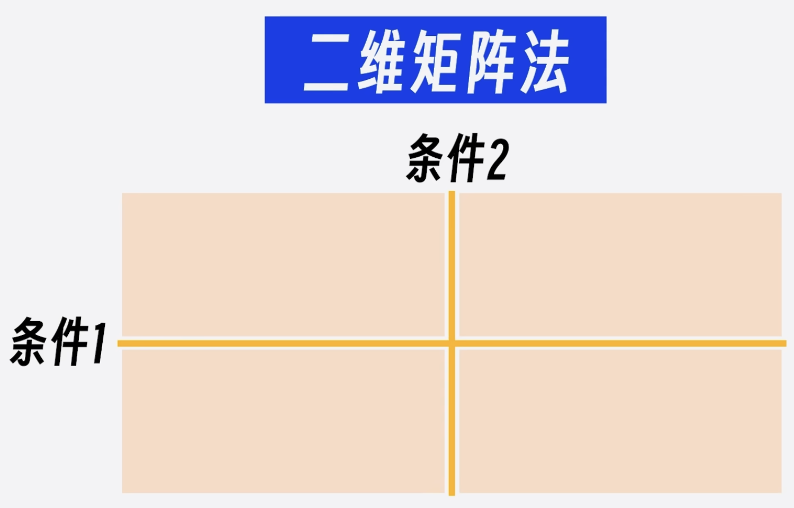
这里，再分享一个极简的MECE表达方法，就是**二维矩阵法**，找到事物的两个条件，横竖各画一条线，分成四个象限，这四个象限分别分析，是一定符合MECE原则的。

---
# 4 汇报前-设计汇报框架
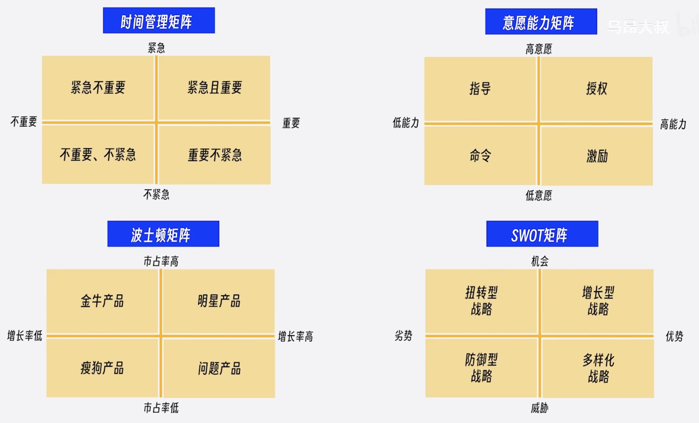
有很多知名的方法论，用的就是这个方法，比如：
艾森豪威尔的时间管理矩阵，就是从重要和紧急两个维度去分析，判断我们处理事情的优先级顺序；
管理者常用的意愿能力矩阵，就是把员工从意愿和能力两个维度分析，找到不同的管理策略；

---
# 4 汇报前-设计汇报框架
咨询界鼎鼎大名的波士顿矩阵，是从市占率和增长率两个维度分析，找到不同的产品策略；
战略规划中常用的SWOT矩阵，是从内部能力和外部环境两个维度分析，找到不同的竞争战略。
这样的例子其实还有很多，在汇报中可以尝试用一下这个方法，领导可能会眼前一亮，

说完了第二个必须，再来看看第三个必须。
##### 第三个必须：每组中的思想必须按照逻辑顺序组织
也就是每组中的思想，谁在前谁在后，同样是有讲究的，不能乱。好在这顺序只有四种，非常好记。

---
# 4 汇报前-设计汇报框架
###### 第一种：时间（步骤）顺序
比如昨天、今天、明天，第一步、第二步、第三步，......
###### 第二种：结构（空间）顺序
比如上、下、左、右，东、西、南、北，......
###### 第三种：程度（重要性）顺序
比如最重要、次重要，......
###### 第四种：演绎顺序
比如问题、原因、解决方案，......

---
# 4 汇报前-设计汇报框架
对于大多数人，前三种顺序一看就明白，第四种演绎顺序可能陌生一点，不过别被“演绎”这两个字唬住了，所谓演绎顺序就是一种线性推理的方式，简单地说，就是后一个思想是由前一个思想推导出来。
汇报中最常用的演绎顺序就是问题、原因、解决方案。 不谈问题，问题原因就不成立；不说原因，解决方案就没有依据；就是这么一步一步的推导。
到这里，金字塔原理最核心的内容就讲完了。
简单总结一下，金字塔原理要掌握三个“必须”、MECE原则、四个逻辑顺序。这些内容比较多，也不容易记得住，可以归纳总结为16个字：结论先行、以上统下、归类分组、逻辑递进。 在设计框架时，金字塔原理的这些标准可以当成检查单来使用，只要汇报框架符合这些标准，那我们的汇报就会让听众觉得逻辑清晰，条理分明。

---
# 4 汇报前-设计汇报框架
**金字塔原理实践案例**
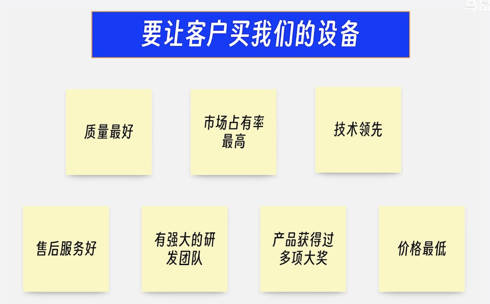
假设我是一名生产设备的销售，想让客户购买我们的生产设备，我的中心论点是：要让客户购买我们的设备。因此就有如下7个理由。
这7个理由放在同一层，明显太多了。

---
# 4 汇报前-设计汇报框架
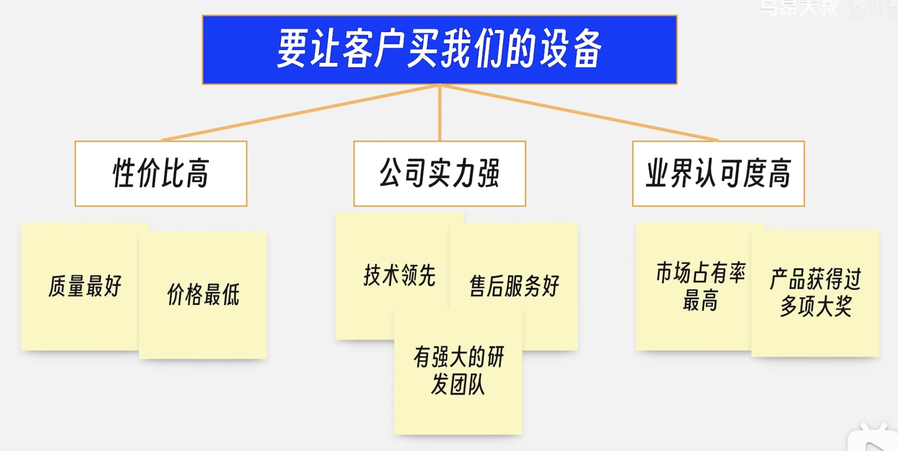
这时候，就需要根据第二个必须把他们分组，分为三组。

---
# 4 汇报前-设计汇报框架
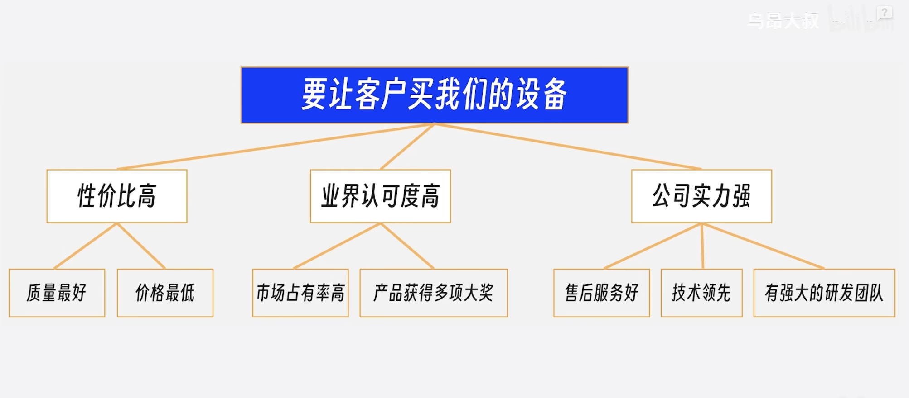
分好组之后，根据第三个必须，按照重要性调整一下顺序。
当然第三层也要按重要性调整一下顺序。

最后调整后的汇报框架，就是一个符合金字塔原理的框架。

但是仔细看一下这个框架，虽然逻辑清晰，但也就那样。
如果我们自己是客户，凭这个汇报框架，还真不一定购买生产设备。

---
# 4 汇报前-设计汇报框架
### 4.3.2 满足听众的期待和价值诉求
因此，用金字塔原理能够帮助我们梳理汇报逻辑，让汇报逻辑清晰，但这还不够。
汇报框架还要有吸引力。

这个时候，在第一步设定目标和第二步分析听众中做的工作就要派上用场了。
汇报的目标和对听众的分析，必须体现在汇报框架中。怎么体现呢？
可以参考三个常用的规则：
#### 建议1：汇报框架的第以层（汇报的中心论点），就是你设定的汇报目标。
#### 建议2：汇报框架的第二层（支撑中心论点的第二字子论点），要覆盖听众的期待和价值诉求。
#### 建议3：框架内的逻辑顺序和内容选择，要兼顾听众的熟悉程度和态度。

---
# 4 汇报前-设计汇报框架
我们还是来看看前面的例子，汇报的目标，是要让客户购买我们的生产设备，这个目标就是汇报框架的中心论点。
假设在分析听众时，发现听众最关心两个问题，一是新设备能不能为公司产生更多的经济效益，二是新设备能不能尽快用起来，不耽误出货。
那汇报框架的第二层就要覆盖掉这两个问题：我方设备能带来更多经济效益；我方设备能在短期内熟练使用。
接下来就要找能支撑这两个论点的论据。
回头看一下前面讲的七个理由，可能会觉得，这些对支撑这两个论点似乎没什么帮助，对的，前面的理由都是从自身角度出发的，现在要站在客户的角度重新看一下这七个理由，找一找对客户有价值的地方。

---
# 4 汇报前-设计汇报框架
质量最好，对客户的好处是什么呢？减少设备停机概率，避免经济损失。
市场占有率最高，对客户的好处是市场上使用这款设备的公司最多，招募操作人员很容易。
技术领先，对客户的好处是，使用新技术，能将设备加工良品率提高到X%，同时提高加工的效率Y% 。
售后服务好，对客户的好处是，出了问题，我们随叫随到，任何问题两个小时之内解决。
有强大的研发团队，对客户的好处是我们可以支持合理的功能优化需求。
产品获得过多项大奖，对客户的好处是由权威人士为客户的决策背书。
价格最低，对客户的好处是比起同类产品更便宜，能直接节约成本X%。

---
# 4 汇报前-设计汇报框架
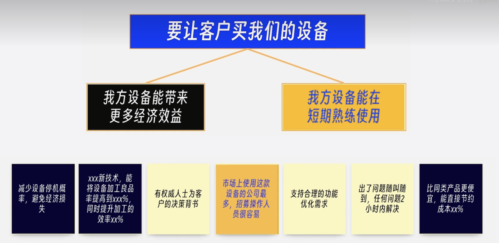
那这些从客户的视角出发，重新寻找的理由能支持好第二层吗？
我方设备能带来更多经济效益有三个论点支撑。
我方设备能在短期内熟练使用 只有招募操作人员很容易能够支撑，而且支撑力度还不太够。

---
# 4 汇报前-设计汇报框架
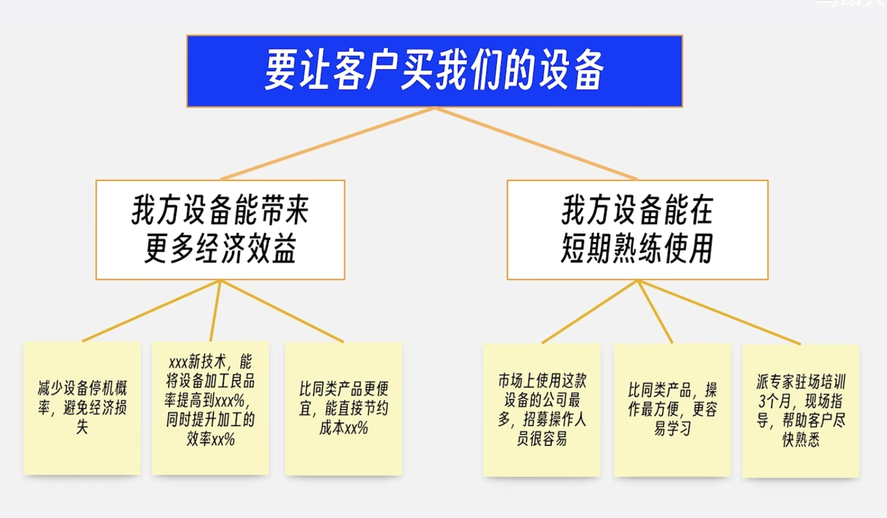
我们需要找找其他论据，比如，和同类产品比，我们的设备操作是最方便的，最容易学习；我们还能派专家现场培训三个月，帮助客户尽快熟悉设备的操作。
现在框架的内容已经能够覆盖掉客户的主要期望了。

---
# 4 汇报前-设计汇报框架

但我们还可以多做一步，给客户增加一个长期保障，让他安心。

---
# 4 汇报前-设计汇报框架
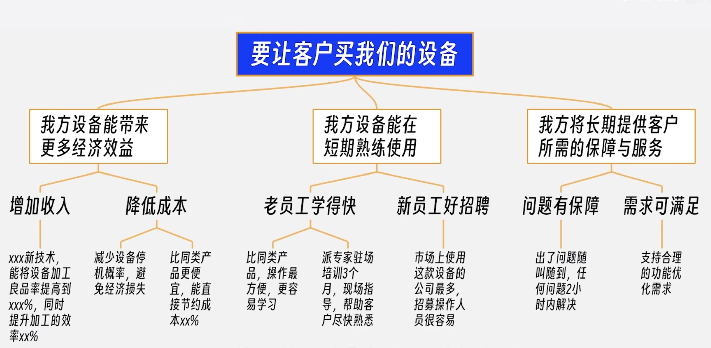
最后，我们按照金字塔原理的三个必须调整一下这个框架，就得到了最终版的汇报框架。

最终的这个框架和前面的多个框架相比，已经有了很大的不同。
如果你是客户，会为那个框架心动呢？

---
# 4 汇报前-设计汇报框架
到这里，设计框架的方法就介绍完了。
一共有两个重点：
1.金字塔结构能让表达清晰；
2.汇报框架要覆盖听众的价值诉求；

---
# 5 汇报前-充实内容
前面一直有强调，汇报本质上是影响听众的一个机会。前三个步骤一直在为影响听众做准备：
第一步，设定目标，就是要搞清楚影响谁，影响到什么程度；
第二步，分析听众，就是要弄明白听众关心什么；
第三步，设计框架，就是要解决如何围绕听众的关心来组织信息。
这三步，对影响听众打下了很好的基础，但还不够，还有个核心问题要解决：听众凭什么相信我们？
脱离信任谈影响，那是云彩里盖房子，空中楼阁。当然，如果你曾经给听众留下过非常靠谱的印象，那对听众信任你肯定是有帮助的，但大多数情况下，我们和听众没有交集，我们需要在短短几十分钟，甚至短短几分钟内解决信任问题。

---
# 5 汇报前-充实内容
那怎么解决听众对我们的信任问题呢？就四个字：有理有据。
所谓有理，就是逻辑上说得通；所谓有据，就是事实上有根据。有理有据就是逻辑与事实完全一致，相互印证。
当逻辑与事实不一致的时候，是不可能产生信任的。
## 5.1 如何做到有理有据？
那么在汇报中，如何做到有理有据呢？
### 5.1.1 如何做到有理？
要做到有理，有两大武器：逻辑推理和借助权威

---
# 5 汇报前-充实内容
#### 逻辑推理（演绎推理）
上期我们讲到了演绎推理，演绎推理是一个重要的逻辑推理形式，它能够提供高度确定性的结论，前提为真，而且推理过程有效，那么结论一定为真。
所以在汇报中使用演绎推理这种逻辑形式，能非常好地增强听众的信任，大家一定要掌握这种推理形式。至少要掌握汇报中常用的演绎逻辑：问题-》原因-》解决方案。这不仅对汇报很重要，对解决问题也非常有帮助。

---
# 5 汇报前-充实内容
虽然演绎推理很好用，但也不可能事事从头推导，这不现实，我们更常用的方法是借助权威。
#### 借助权威
一个不能被忽略的现象是人普遍信任权威，这里边有心理因素的影响，也有现实因素的考量。
从心理因素看，信任权威能降低人的认知负担，给人带来安全感。
从现实因素看，权威有专业知识，有资源优势，还有长期实践的支撑，确实结论正确的概率更高。
有四种权威结论是经常出现在汇报中的

---
# 5 汇报前-充实内容
##### 第一种，科学的结论
比如说，物理学中的能量守恒定律、熵增定律，生物学中的自然选择学说，心理学中的马斯洛需求层次理论，......
这些多数人都听说过，更多的科学理论可能没被大众听说过，那这个时候，就要引用相关的论文来支撑自己的观点。
##### 第二种，致命的方法论或权威机构的研究成果
比如说，大家沟耳熟能详的PDCA戴明环，上一节讲到的金字塔原理，还有麦肯锡，GARTNER的报告都属于这种。

---
# 5 汇报前-充实内容
##### 第三种，名人名言
比如说，《道德经》中的“天下大事必做于细，天下难事必作于易”，《荀子.修身》中的“道虽迩，不行不至；事虽小，不为不成”
##### 第四种，权威认证
比如说，ISO认证，PMP认证，这些常用来证明公司或者个人的能力。

请注意啊，逻辑推理和借助权威并不是二选一的关系，经常结合在一起使用。
比如说，我们逻辑推理的起点很可能是某个专家的结论。

---
# 5 汇报前-充实内容
说完了有理，怎么做到有据呢？
### 5.1.2 如何做到有据？
也不外乎两个办法，看整体和看个例。
看整体，就是寻找对对群体影响的证据，通常用统计数据来体现；
看个例呢，就是寻找对个例影响的事例，通常用故事和案例来影响。
比如你说某个产品很受欢迎。可以用销售增长率和市场份额这两项统计数据来证明，看，这就是整体。
同样的，也可以讲述几个客户使用该产品后的真实反馈来证明，这就是看个例。
当然，用统计数据需要注意数据的来源和权威性，保证数据真实可靠与事实一致。在讲述案例的时候，可以使用对比数据和真实的故事来增强可信度。

---
# 5 汇报前-充实内容
请注意啊，看整体和看个例，并不是二选一的关系，经常组合起来使用。
统计数据能让听众看到全局，具体案例能让听众发现细节。
把他们组合在一起，效果才是最好的。

## 5.2 怎么让“理”和“据”保持一致？
现在有了“理”，也有了“据”，那理和据必须保持一致才能做到有理有据，那怎么才能保持一致呢？
答案就两个字：真诚。
前面也说了，有理有据的核心是逻辑与事实达成一致。
如果你真是这么想的，也真是这么做的，那这两个天然就是一致的，根本不需要去费力硬凑。

---
# 5 汇报前-充实内容
如果两者不一致，那说明其中有一部分是编的，那这是汇报的大忌，这是在拿自己的职业前途去赌。
请记住，真诚才是获取信任最好的方法，所以在缺乏事实的时候，我们可以只谈逻辑；在缺乏逻辑的时候，也可以只谈事实。
这虽然不完美，但远远好过胡编乱造。

到这里充实内容的方法和技巧就讲完了。我们在用一个简单的例子来练习一下。
假设你是一位项目经理，公司有新项目要启动，你希望能负责这个项目，你可以准备哪些材料来争取这个项目呢。

---
# 5 汇报前-充实内容
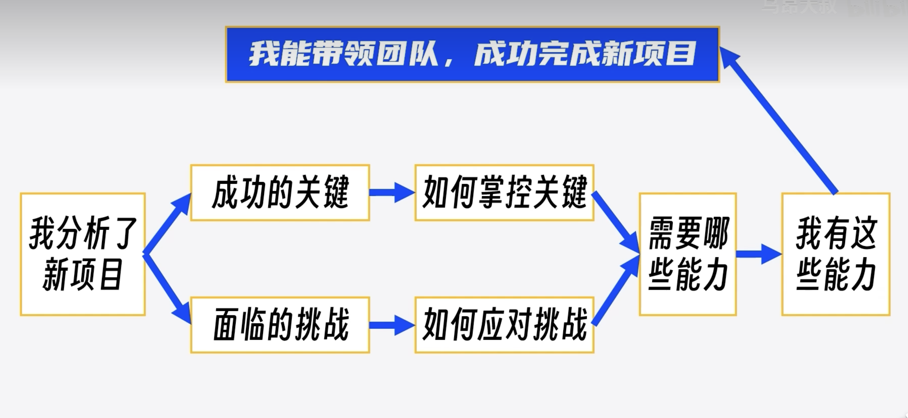
根据我们前面讲的内容，可以从有理有据两个部分来寻找支撑材料。
先看有理部分（逻辑推理，借助权威），你需要一个逻辑推理的过程，得出“我能带领团队，成功完成新项目”这个结论，比如下面这个推理过程：

---
# 5 汇报前-充实内容
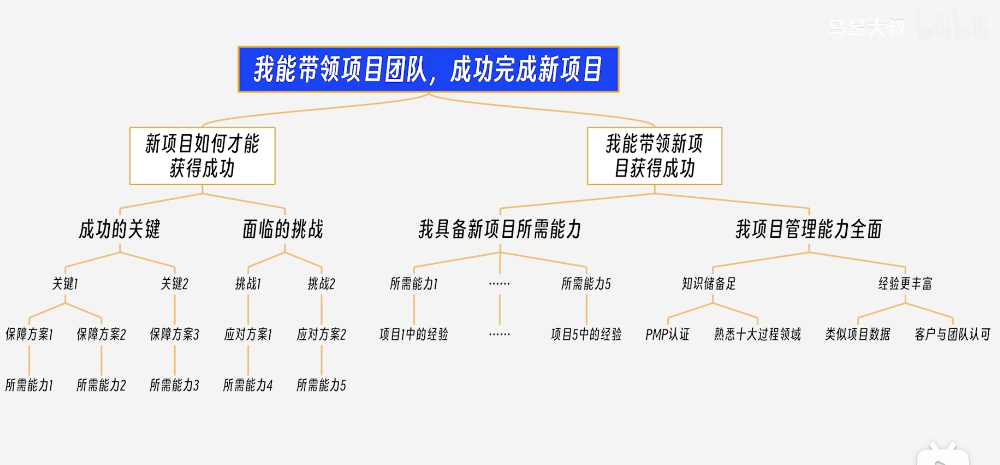
说完了有理，再来看看有据（看整体，看个体）的部分，从整体上可以找到哪些材料呢？比如说，我做过项目的历史绩效数据，那这个可以用来证明你项目管理的综合能力；从个例上也可以寻找一些材料，比如说，我在某个相似的项目中应对过问题的具体经验，可以用来证明我们具有某个关键能力，客户、项目成员对你的评价，可以用来证明我们的管理能力。

---
# 5 汇报前-充实内容
找到这些材料，把他们组织在一起，就能够非常有好的支撑你的观点，左侧是一个示例，可以参考。

有了内容支撑，我们的汇报材料在信息上已经很完整了，不过啊，要做到影响听众，汇报材料依然有优化的空间，下一步就需要调整优化了，让听众更容易理解我们的汇报。

---
# 6 汇报前-调整优化
## 如何让听众更容易听懂？
### 让听众的直觉听懂

怎么才能让听众听懂呢？要想让听众听懂，就先要让听众的直觉听懂。让听众的直觉听懂是什么意思？
**《思考.快与慢》-直觉与理性**
要讲清楚这个问题，就需要补充一个非常重要的心理学知识，已故的心理学家、诺贝尔经济学家得主丹尼尔.卡尼曼在他的《思考.快与慢》中为我们展示了一个非常重要的心理学研究成果，人由两套思考系统：

---
# 6 汇报前-调整优化

系统1的运行是无意识的，速度很快，不怎么费脑力，几乎感觉不到它的运行。
比如当我们看到屏幕上这张图片，瞬间就能感受到愤怒.

---
# 6 汇报前-调整优化

系统2与系统1完全相反，需要集中注意力，他才能正常运行，
比如当我们看到屏幕上这道题，我们可能需要算半天，甚至还需要借助草稿纸才能算出来。

---
# 6 汇报前-调整优化

系统1，我们称之为直觉；
系统2，我们称之为理性。
可以把直觉和理性想象成大脑中住着的两个小人，平常我们的决策都是这两个小人合作的结果，尽管我们都希望理性的这个小人儿能在思考中占主导地位，让我们时刻保持头脑清醒、逻辑严密、善于决策，但事实上，那个叫“直觉”的小人儿才是大脑中的直觉，平时都是他在决策，只有他遇到麻烦了，他才会呼叫“理性”出来帮忙。

---
# 6 汇报前-调整优化

而“理性”这个小人懒得出奇，他一点也不愿意多付出，只有在遇到一些非常重要的事情时，他才出面，而且他出来时间长了，你的脑力会被快速消耗，从而感到疲惫，所以，哪怕是那些看似“理性”的小人做出的决策，实际上也都是在只觉得引导下才完成的。不信的话，我们来测试一下右面这个问题。

---
# 6 汇报前-调整优化
生活中，能说明直觉主导决策的例子更多。
比如我们啥短视频的时候，不知不觉一小时就没了，在这个期间完全是直觉在主导我们的决策，为什么会这样？这就是进化带来的特性。
干体力活也好，还是思考也好，身体都要遵循“最省力原则”，用最少的能量来处理事情，不管你喜欢不喜欢，都是逃不开这个特性的。
但我们总会发现一些人非常善于思考，时刻都能保持理性，难道这些人不受制于“最省力原则”吗？同样受制于这个原则，区别在于他们展现出来的理性是通过长期的练习，把理性系统擅长的事变成直觉系统也能做的事情。
这就像开车、有用、骑自行车一样，刚开始学的时候，是都需要理性来参与的，可一旦学会了、熟悉了，靠直觉也能完成。
总之，在人类大脑中，“直觉”才是老板，“理性”顶多算个顾问，老板遇到麻烦了，才会找顾问出来解决，而这个顾问支撑不了多久，很快就懒得听了。
让听众的“直觉”听得懂，现在大家应该知道了。

---
# 6 汇报前-调整优化

汇报，要跟老板谈，怎么让听众的直觉听懂呢？
就是让我们的理性去说服听众的直觉。
什么意思呢？就是把困难留给自己，用你最好脑力的理性系统思考清楚，然后对着听众最节能的直觉系统进行一通输出。
用你的理性系统思考清楚，对着听众的直觉系统输出。
总结成十个字就是：理性化思考，直觉化表达。

---
# 6 汇报前-调整优化
### 直觉话表达的技巧
前面四个步骤，其实是一直都在引导用理性系统进行思考，只要真的完成了前面的步骤，理性化思考就已经做得差不多了。
到第五步，调整优化的重点是**集中宝贵的脑力，动用理性系统，完成直觉话表达的改造**。怎么做呢？
斯坦福大学组织行为学教授奇普.希思和他的弟弟丹.希思合著了《行为设计学-让创意更有粘性》一书，在这本书中，他们总结了六大原则：***简单、意外、具体、可信、情感、故事*。
这六大原则就是直观化表达最有利的武器。

---
# 6 汇报前-调整优化
**原则1：简单**
直觉系统喜欢简单，因为这样符合最省力原则，但简单不是断章取义，而是要你的表达简短，且深刻。
那些广为流传的金句普遍都有这个特点，比如：时间就是金钱，知识就是金钱。 简短，但却蕴含深刻的含义。
所以呀，我们的汇报材料要尽量做到简单。提炼核心的内容，删掉冗余的句子，直达听众的内心。
有一个常用的办法，直接引用金句或套用金句模式。比如刚才提到的知识就是力量，可以模仿这个句子写一堆，比如：健康就是财富，创新就是生命，平凡就是幸福，教育就是未来，......

---
# 6 汇报前-调整优化
**原则2：意外**

设置意外的目的，是吸引听众有限的注意力，把他们拉回到汇报中。
但请注意啊，并不是让你不顾一切的制造意外，汇报中的意外还需要在“情理之中”，这就需要开动我们的脑力，寻找“意料之外，情理之中”的观点、数据、案例......
如果啊，实在不知道怎么设置意外，有一个比较保险的方式，就是自问自答。
比如年终汇报，要展示团队的业绩，可以像右边这么说。
看，这就是一个最简单制造意外的办法，第一，听汇报的的人默认都是听，没想过会被提问；第二，人都有好奇心，听到问题就会好奇问题的答案，看，注意力这不就来了吗。

---
# 6 汇报前-调整优化
**原则3：具体**
“直觉”只擅长处理具体的事务，对于数字、理论这种抽象的概念不敏感。所以在汇报中要尽量将抽象的东西具象化，数字和大段的文字可以转换为图表，我们常说的文不如表，表不如图，说的就是要具象化。
抽象的逻辑关系，也可以画成图形，屏幕上就是一些逻辑图形的示例，抽象的概念可以用类比来辅助理解。
比如：黑洞就像一个强大的吸尘器，它的强大引力可以吞噬周围的一切，包括光。
不过大家要记住，一切类比都是不当类比。就业是说类比只能用来辅助理解，不能用来判断对错。
所以啊，使用类比时也要注意听众的思维偏好，面对那些比较擅长理性思考的人，可以尽量少用甚至不用，比如埃隆.马斯克就不喜欢类比的方法。

---
# 6 汇报前-调整优化
**原则4：可信**
听众的直觉产生怀疑的时候，他们的理性会跳出来审查你的内容，如果上一步你已经做的有理有据，那可信的基础已经做的比较扎实了，这一步，你只需要把PPT做的像点样子。
这里要提一下光坏效应，先入为主的信息，会影响对事物整体的判断，听众在一开始看到一个像样点的PPT，他会更容易相信你说的内容，至于如何做一个像样点的PPT，网上的资源和工具比较多，就不啰嗦了。

---
# 6 汇报前-调整优化
**原则5：情感**
关于情感，心理学界有两大共识：（1）人类是先有情绪，后有的认知；（2）情绪的作用比认知的作用强大。
人类有很多的认知行为，都因为有情绪的参与而事半功倍，比如你现在回忆一件让你印象深刻的事情，你看看其中是否有情绪的参与。虽然在职场汇报这个场景下，人人都觉得更应该理性，但情感的影响依旧非常强大，有很多经常在汇报中出现的词汇都暗戳戳地向听众传达着积极的情绪，比如：成功、胜利、丰收、希望、梦想、乐观、勇气、信心、学习、成长、进步、团结、奋斗、坚韧不拨、永不放弃......
所以， 可以放心地在汇报中增加情感的部分，尤其是面对女性听众的时候，比如，可以强调企业共同的价值观、社会责任感、企业对行业的贡献，也可以感谢团队的支持和领导的栽培。
只要是发自内心的感受，听众都会有共鸣的。

---
# 6 汇报前-调整优化
**原则6：故事**
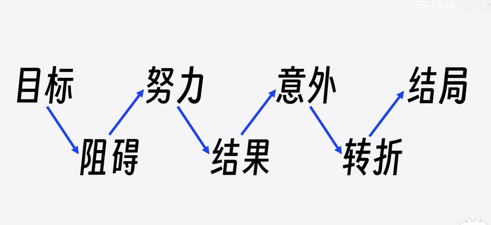
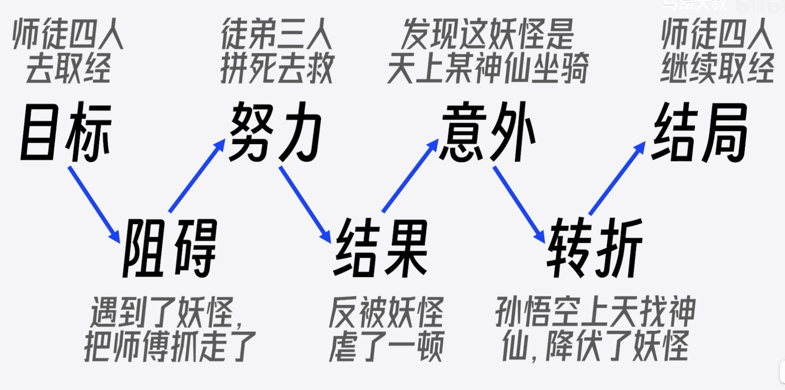
听故事是人的天性，比起听道理，人更喜欢听故事，故事比道理更能影响人的思维。
在今天这个时代，会讲故事的人，他的机会会更多。上一期讲过，你曾经做过的案例，都可以用故事的方式讲出来，如果不知道怎么把案例变成故事，那就可以参考编剧们常用的故事万能公式（右图）。
记不住这七个步骤也不要紧，我们都看过西游记，西游记九九八十一难，几乎都是这个套路。

---
# 6 汇报前-调整优化

简单、意外、具体、可信、情感、故事，这六大原则就讲完了。
希望大家能记住这六大原则，因为这六个原则，除了在汇报中常用，在写作、演讲、讲课、广告创意、营销传播、商务谈判等等，只要是与人交流的事情中都非常常用，

