<!-- _paginate: skip -->

# 汇报

## 七个步骤变身汇报达人
（职场汇报系列）

---

# 1 概述
## 1.1 前言
汇报这个技能不仅常用，而且非常重要。
有些汇报结果，可以决定我们的职业前途，比方说转正答辩，年终述职，解决方案介绍，项目进展汇报等等

面对这种汇报，有些人不知道该怎么准备的；汇报材料改来改去，就是感觉差点意思。
一到汇报的时候，大脑立刻就宕机了，都不知道自己在说些什么；原本30分钟的回报10分钟就讲完了。

如果有上述问题，就需要系统提升自己了

---

# 1 概述
## 1.2 关于汇报的两个问题
关于汇报，我们要先搞清楚两个问题，因为这两个问题的答案，决定了评价了一场汇报好坏的标准。
## 问题1：为什么职场人总是要汇报？
很多人其实挺讨厌汇报的，每次都要花好多时间去准备汇报，反复地修改同一份汇报材料。你说有这点时间干什么不好呢？
从个人的视角看，汇报的确有点浪费时间。
但从企业的视角看，汇报是公司管理者了解信息效率最高的方式。管理者的层级越高，组织的规模越大，就越是如此。

---
# 1 概述
大家想啊，公司一把手最重要的工作是什么？就是决策啊，围绕决策就离不开信息
一把手了解公司的信息效率最高的方式是什么呢？一个人一个人的问肯定不行，一是浪费时间，一把手最缺的就是时间，二是下属随口说的信息质量很难保证，那么最佳策略就是约定一个时间，请下属好好准备来汇报一下工作。
所以说，汇报是为了提高听众获取信息的效率。这里的听众，你可以理解成你的老板，或者是你的客户，也就是你要汇报的对象

---
# 1 概述
## 问题2：汇报的本质究竟是什么？
说到底，汇报就是沟通的一种形式。沟通，除了传递信息，更重要的是要影响听的人.
我们要让听的人了解某种观点，产生某种情绪，或者出发某种行为。
我们就算是平时和别人聊聊八卦，那也是为了让我们和其他人的关系更近一点。
所以说，汇报本质上是影响听众的一个机会。而这些听众往往对我们的利益会有很大的影响。

---
# 1 概述
## 1.3 好的汇报的两个标准
这两个问题聊完，那好的汇报标准也就很明确了。

## 标准1：让听众获取信息效率越高的汇报，就是越好的汇报
翻译成人话，就会好的汇报，它能让听众愿意听，记得住，好理解。

## 标准2：对听众产生影响越大的汇报就是越好的汇报
就是好的汇报，它能改变听众的观点、态度和行为。
比如说，转正答辩之后，我们变成了一个正式员工。
年终汇报之后，我们能够获得升职加薪的机会。
项目进展汇报之后，领导决定给你的项目追加投资。

---
# 1 概述
## 1.4 做好汇报的3个阶段、7个步骤
当然这两条标准，做到那哪一条都不容易，但只要掌握7个步骤，会让我们汇报的效果大幅提升。
他们分别是：**汇报前的五个准备工作：设定目标、分析听众、设计框架、充实内容、调整优化，汇报中的从容演绎和汇报后的复盘回顾.**
当然后步骤的数量上，我们也能看得出来，最重要的就是要做好汇报的准备工作.
一场汇报的好坏还很大程度上是有准备工作决定的。

---
# 1 概述
接下来对每个步骤做个概述

### 第一步：设定目标
有很多的回报逻辑清晰、内容详实，讲的也很有自信，但就是离题太远。
**明确汇报目标是汇报成功的关键。**

### 第二步：分析听众
前面也讲了，好的汇报有两个标准：
让听众愿意听、记得住、好理解。改变挺重的观点、态度和行为。
如果仔细留意的话，这两个标准都是围绕听众的，你多了解听众一点，汇报的效果就会更好一点。

---

# 1 概述

### 第三步： 设计框架
这一步就是要确定汇报的逻辑结构，就像人需要有骨架一样，好的汇报框架能让你的表达更加清晰，让听众更容易记得住，更容易抓住你表达的重点。

### 第四步： 充实内容
就是要补充各种论证材料，就像人需要血肉一样，优质的论证材料能很好地支撑你的观点，增强你汇报的可信度，提升你的说服力。

### 第五步： 调整优化
这是优化表达方式的过程，它就像啊，给人穿上各式各样的衣服，能让汇报更容易被听众理解

---

# 1 概述

### 第六步： 从容演绎
这个过程，就是你在汇报的时候，如何才能更好地控制自己的紧张情绪，能够自信地完成一次汇报

### 第七步： 复盘回顾
一次汇报结束了，还会有下一次，每次汇报的复盘回顾，能让你的汇报能力越来越强，汇报的成功率越来越高，职业生涯越来越顺。

这七个步骤就是提升汇报能力的核心内容，后面会围绕这三个阶段七个步骤详细展开，把每个步骤后面的原理、方法和技巧详细地分享展示。

---
# 2 汇报前-设计目标

很多人准备汇报，第一步就去找PPT模版，或者直接套用曾经使用过的模版。
直觉上，这样做不仅可以省去美化PPT的时间，而且PPT自带的结构，还能提供一点准备汇报材料的思路。
但省事往往是有代价的，这样做往往至少有两个隐患：
第一个隐患，本末倒置。
在上一期概述中，我们有强调，汇报是一种特殊的沟通形式，其本质上是影响听众的一个机会，所以想清楚如何更好的影响听众，远远比你比写一份汇报材料更重要。
套用模版会让你直接进入写PPT的过程，减弱了重要的思考过程。
因此要注意，PPT只是辅助我们影响听众的工具而已，并不是汇报本身。
如果你愿意，你完全可以用白板，甚至什么都不用来完成你的汇报，当然前提是你想的足够清楚，准备的足够充分。

---
# 2 汇报前-设计目标

第二个隐患，限制思路。
模板中自带的结构也许还不错，但他不一定适合你本次的汇报。
人都有依赖心理，当我们对一件事情信心不足的时候，会本能的向外求助，模版就扮演了一个被求助的角色，一旦我们认可了模版中的结构，就很难再从模版中的思路跳出来。
所以，越重要的汇报，就越不能从找模板开始，那会大大增加汇报失败的风险。
准备汇报的第一步应该是想清楚为什么要做这次汇报，汇报的目标究竟是什么？
那究竟该如何设定目标呢？

---
# 2 汇报前-设计目标
## 2.1 如何设定目标？
明确汇报的目标就是要明确影响听众到什么程度。
用一个抽象的模型来表示，就是要把听众从A状态改变到B状态。
听众可以从对一件事毫不知情，到对这件事非常清楚；
听众可以从对一件事充满疑虑，到对这件事充满信心；
听众可以从对一件事充满抵触，到对这件事积极行动；
如果用一句话来明确汇报的目标，那这句话可以这么说：
**这次汇报要让【WHO】【采取WHAT行动】**
重点是既要有听众是谁，又要有听众状态变化的程度

---
# 2 汇报前-设计目标
我们来做个小练习，请选择哪一类是更好地汇报目标：
|第1类|第2类|
|---|---|
|这次汇报**我要**介绍一下我们的解决方案|这次汇报要让**客户的总经理**了解我们的解决方案|
|这次汇报**我要**介绍一下我试用期取得的工作成绩|这次汇报要让**直属经理**批准我通过试用期|
|这次汇报**我要**汇报一下新项目需要追加300万的预算|这次汇报要让**董事长**为新项目追加300万的预算|

---
# 2 汇报前-设计目标

你的答案是什么呢？
我的答案是第2类（右侧）的目标是更好的汇报目标。
大家注意！这两类目标最大的区别是关注的对象不同。
第1类关注的是自己想要什么，而第2类关注的是对听众改变的程度。
可以感受一些这两类目标的区别，并回忆一下，我们汇报时最常设定的目标是哪一类呢。

我们说了设定汇报目标的句式，那么是不是只要符合这个句式的汇报目标就是一个好的汇报目标呢？

---
# 2 汇报前-设计目标
## 2.2 好的汇报目标的细节
好的汇报目标，有两个细节是一定要注意到的：
### 第一个细节，我们要影响的听众究竟是谁？
前面的例子，似乎我们要影响的听众很明确，但某些汇报可能有很多人来听，那究竟应该重点关注谁呢？是权力最大的听众？大多数听众？还是全部听众？
这里可以参考一个判断原则，要关注对汇报目标影响最大的听众。
那这是不是意味着只要关注职位最高、权力最大的听众就好了呢？
答案是看情况，具体问题要具体分析。

---
# 2 汇报前-设计目标
我们已转正答辩为例，如果所有听你转正答辩的人中，只要有一个人投反对票，你就不能通过转正，那么你就应该关注全部的听众。
如果多数听众投赞成票，你就能转正，那么你就要照顾到尽可能多的听众。
如果你的直属主管能决定你是否转正，那么你就要重点关注你的直属主管。
当然原则虽然简单，但是执行起来并不容易，这里讲一个故事案例。
有一次，我要为某公司总经理汇报我们的技术解决方案，汇报前，我了解到这位总经理是一个对技术不太了解的人，所以我可以针对他把汇报材料调整的非常的浅显易懂，力求让他一听就明白，汇报当天，总经理哦带了一个人一起听，总经理在听我汇报的时候频频点头，似乎很满意。但跟他一起来的人全程一言不发，当我汇报完之后，总经理砖头问那个一言不发的人，问他觉得怎么样。

---
那个人说，他没有听到什么实质性的技术细节，并没有感觉到我们解决方案的技术亮点。
结果，总经理立刻改变了态度，没有给我们合作的机会。
这个案例中的失败，就是因为我自认为不懂技术的总经理，是对结果影响最大的人，却没有提前调查会不会有其他人也来参会，参会的人会不会对结果产生影响。
由此可见，没有搞清楚对结果产生影响的人，代价是非常大的。
所以，关注会对结果产生影响的听众真的很重要。

---
# 2 汇报前-设计目标
### 第二个细节，目标达成的潜在条件是什么？
前面列举的第1类的3个目标最终都是要对自己有利的，那么请问，听众凭什么要做出对你有利的选择呢？
通常情况下，人只会作对自己有利的选择，如果听众做出了对你有利的选择，那么这个选择一定也是首先对他自己有利的，
目标达成的潜在条件是你能为听众提供什么价值，能让他满足自身利益的前提下满足你的利益。

---
# 2 汇报前-设计目标
回头重新看一下前面提到案例第2类的三个目标：
（1）这次汇报要让**客户的总经理**了解我们的解决方案。
 --> 客户总经理并不关心你的解决方案，他只关心你的解决方案能不能解决他的问题，所以这个目标的潜在条件可以明确成为：要让客户的总经理了解我们的解决方案，能解决他们的什么问题。
 （2）这次汇报要让**直属经理**批准我通过试用期
 --> 直属经理并不真正关心你过不过试用期，他只关心你未来能不能为公司和团队创造价值，所以这个目标的潜在条件可以明确为：要让数值经理相信我未来能为公司和团队带来价值

 ---
# 2 汇报前-设计目标
 （3）这次汇报要让**董事长**为新项目追加300万的预算
 --> 董事长不关心你的项目是否缺300万，他只关心这300万投下去，能不能给公司带来更大的回报。所以这个目标的潜在条件可以明确为：要让董事长理解追加300万预算之后，这个项目能为公司带来更大的回报。

 当然，听众的价值诉求可能不止一个，在分析目标的时候，我们应该尽量都识别出来，并按重要性排序，优先关注听众最关心的价值诉求，
 **听众关心的价值，我们分析的越清楚，我们离目标达成就越近。**

 ---
# 2 汇报前-设计目标
 认真考虑这两个细节之后，设定出来的汇报目标才是一个离汇报成功最近的靶心。瞄准它，汇报就成功了一半。
 我们可以把设定出来的目标贴在一个最显眼的地方，在你准备汇报材料的过程中，时不时地看一看。

 当然在分析听众的价值诉求时，你可能会发现，一个最大的障碍就是你对听众毫不了解，那我们应该如何去了解听众，分析听众，让汇报更好的影响听众呢，那就是下一个步骤了。

---
 # 3 汇报前-分析听众
前面一直有强调，汇报本质上是影响听众的一个机会，要做到影响听众，前提就是了解听众。
这就像去看病，医生一定会先问问病情，要求做几项检查，然后才会开药。
如果医生上来啥都不问直接开药，你一定觉得这个医生不靠谱。
在汇报这件事上，我们99%的人，都是那个啥都不问的医生，经常在对听众一无所知的情况下就写完了汇报材料。
不过这还真怪不得我们，谁都知道，问清楚再去准备汇报材料，当然好啦。
但听汇报的不是领导就是客户，大多数情况下，他都不会给我们问清楚的机会。那没法直接询问听众，

---
 # 3 汇报前-分析听众
那我们又该怎么分析听众呢，办法还是有的，那就是猜！猜这个说法不好听，我们换个说法叫推断。其实不管用哪个词，本质上都是一个意思：**要基于有限的信息推测出一个可能得结果。**
那这里面的结论的准确程度，完全依赖于信息的丰富程度。也就是说**信息收集的越全面，结论就越准确。**
在生活中，一个典型的例子就是互联网平台，互联网平台从来不会直接问你的喜好，但却比你自己还了解你自己。靠的就是想方设法收集你的数据，在后台不停的分析你。
那我们了解听众的逻辑，和互联网平台了解我们的逻辑是一样的，只不过互联网平台有大数据，而我们就只有自己。

---
 # 3 汇报前-分析听众
 ## 3.1 怎样才能把听众分析的清清楚楚呢？
那下面重点介绍一下怎样才能把听众分析的清清楚楚呢？重点分成两个部分来回答这个问题：
第一，要收集听众哪些信息？第二，怎么收集这些信息？
### 第一，要收集听众哪些信息？
先来看第一问题，要收集听众哪些信息？这里面有三类信息是要收集的。
按照对汇报的影响程度，依次是：
第一类：与汇报主题相关的信息。
第二类：听众的角色与职责。
第三类：听众的个人特征。

---
 # 3 汇报前-分析听众
第一类，也是最重要的一类，与汇报主题相关的信息。这里面除了汇报安排在什么时间、地点，要将多长时间，谁会参会这种基本信息外，还有三个需要特别关注的点：
(1)听众对主题的熟悉程度
想象一下，现在让我们去听北大韦神的数学课，我们一定一脸懵，为啥呢？根本没那个数学基础嘛，同样，如果是一群对汇报主题毫不了解的听众，听我们大谈对某个主题的深度见解，他们一定想让我们尽快闭嘴。
因此，**了解听众对汇报主题的熟悉程度，才能控制好汇报的信息深度。**
如果听众对主题非常熟悉，那么我们可以讲得有深度一下；否则最好从基础开始，逐步递进，而且尽量使用一些通俗易懂的语言，用生动的例子来讲述观点。

---
 # 3 汇报前-分析听众
(2)听众对主题的立场和态度
听众对主题的立场和态度决定我们汇报的角度。大家想啊，如果听众对汇报主题持支持态度，那么我们当然可以强调已经取得的成果，未来的发展前景，以强化他们的支持嘛。但是如果他们持的是怀疑态度，甚至是反对态度，那么我们最好准备好应对他们质疑的论据，客观地分析可能存在的问题，并合理地提出解决方案。这样才能改变他们的立场。
（3）听众对主题的期待
对同一个主题，不同的听众会有不同的期待。
比如说，中高层领导期望听到明确结论和决策依据；那基层领导呢，更关注具体的操作步骤和实施计划；合作伙伴呢，可能更关心合作的机会和利益分配。
所以啊，在汇报中，只有满足不同听众的听众，他们才可能听我们说话，我们才能影响他们。

---
 # 3 汇报前-分析听众
第二类信息，听众在组织中的角色与职责。
请注意，听众的关注点往往与他们的角色和指责有关。
比如说，高层管理者会关注公司的战略方向、财务状况和整体业绩，而中层管理者呢，可能更关心部门的运营效率、团队协作和资源分配。搞清楚听众的角色和职责，能很好地帮助我们发现听众的价值诉求。
第三类信息，与听众个人特征相关的信息。
这里面要了解听众的年龄段、性别、思考习惯、沟通风格甚至是禁忌这样的信息。
年龄，它不只是一个数字，他能反映出一个人的阅历、喜好和身体情况，不同年龄段的人差异很大。这里随便举两个例子，对那些年轻听众，在汇报中使用时尚、活泼的语言，很可能拉进和他们之间的关系；但如果是年长的听众，用这种方式，很可能让他们觉得你不认真、不严肃。年轻听众，他眼神好啊，PPT中的字小一点，问题不大；但年长的听众，PPT中的字最好要大一点，因为他们可能眼神不好，看不清。

---
 # 3 汇报前-分析听众
性格差异对汇报也有影响。我们都知道，多数女性听众偏感性一点，而多数男性听众偏理性一点，我们就需要针对这种差异，适当的调整汇报材料的感性和理性的比重，怎么调呢？后面的课程会有涉及。
听众的思考习惯也会影响汇报的风格，有些人倾向于逻辑分析、理性思考，那么我们的汇报，就需要提供严密的逻辑论证和充分的证据支撑。而有些人呢，可能更注重直觉和情感体验，那么我们的汇报可以通过生动的故事、案例和形象的比喻来引起他们的共鸣。
还有，需要注意，不同的人有不同的沟通风格，有些人喜欢口头交流，有些人更喜欢书面材料，那我就曾碰到过那种喜欢自己看大段文字，有问题就提问，不喜欢听他人讲的听众，所以了解听众的沟通风格，也能让你汇报材料准备的更充分。

---
 # 3 汇报前-分析听众
最后，还需要了解听众有哪些禁忌，也就是听众讨厌什么。比方说某些文化和宗教背景的听众，可能对特定的话题和表达方式比较敏感；某些组织呢，有可能有特定的行为规范。 汇报前，最好充分了解这些禁忌，防止汇报内容引起听众的反感，避免功亏一篑。
这三大类信息了解的越详细，越有助于准备汇报。
不过，我们也别太追求完美了，根据一般经验，这么多信息，那总有没办法搞清楚的，这种情况也不用完全担心，我们只要搞清楚了最重要的第一类信息，就已经能帮助我们把汇报材料准备到80分了。

---
 # 3 汇报前-分析听众
 说完了第一个问题：要收集听众哪些信息。接下来再聊聊这些信息怎么收集过来呢？有四个办法。
 ## 3.2 怎么收集这些信息？
第一个办法，也是最快的方法：问。
不但要问，而且要多问几个人，以消除他们的个人偏见，问谁合适呢？有两类人。
第一类是比你更了解听众的人，比如说那些和领导有密切接触的业务骨干，经常和领导一起开会的秘书，与客户合作过的销售人员等等，
第二类是，曾经向同一个听众做过汇报的人，可以问问他们的经验。比如说听众提出过什么问题，他们的回答以及听众的反馈等等，可以从他们的经验中获取有效的信息，帮助我们更好地汇报。

---
 # 3 汇报前-分析听众
第二个办法：观察。
平常要多观察，要多留意领导的发言和行为。
他们对不同问题的反应，提出过哪些问题，强调过哪些重点等等，都能反映出他们的关注点和思考习惯。 这里举个例子，比如说某个领导在多个场合都强调过创新的重要性，那么创新一定是他最关心的东西。在汇报中，可以突出创新方面的内容。
第三个办法：查资料。
公司内部有很多文档资料，比如说，会议纪要，项目报告等等，这些资料，其实就蕴含着领导对特定问题的看法和期待，仔细研究这些资料，能够很好地帮助我们把握汇报的方向。
还有第四个办法：研究组织的战略目标
领导和客户的关注点，通常都跟这个组织的发展方向密切相关。比如说，公司现在正在进行数字化转型，那么跟数字化转型相关的内容，很可能就是领导关注的内容。

---
 # 3 汇报前-分析听众
请注意，这四个办法是可以组合起来使用的，越重要的汇报，就越要尝试不同的方法来获取更多的信息，这样才有助于我们更好地分析听众。

到这里，分析听众的办法介绍完了，大家可能觉得这太麻烦了，有这种想法也很正常，人嘛都是能省事就省事。
其实呀，只有开始有意识地收集听众的信息，并尝试从中分析出对汇报有帮助的内容，就已经超过95%的职场人了。
至于愿不愿意，费点劲儿成为职场中最顶尖的5%，那就看自己个人选择了。毕竟人生没有白走的路，每一步都算数。

 ---
 # 4 汇报前-设计汇报框架
 ## 4.1 什么是汇报框架？
简单来说，**汇报框架就是汇报中信息的组织方式**，也就是搞清楚先讲什么，后讲什么。
这重要吗？很重要。为什么？这里举个例子感受一下。
上班前，你女朋友，跟你说：我想吃葡萄，你下班了带着葡萄回来，顺便买点牛奶，哦，还有啊，我看看家里是不是没有土豆了，哦，果然没了，接单也没了，都买点吧，你再买点胡萝卜，橘子也买点，含有咸鸭蛋，苹果也买点，再带一盒酸奶。请问，你女朋友让没什么？回忆一下，能回忆出几样？
那如果你女朋友换个说法：你下班的时候，带九样东西回来，蛋奶类，要买牛奶、酸奶、鸡蛋和咸鸭蛋；水果我要吃橘子、葡萄、苹果。蔬菜买点土豆和胡萝卜。

 ---
 # 4 汇报前-设计汇报框架
在第二个说法下，在回忆下要买哪些东西？是不是发现自己的记忆力突然变好了？
这里就可以看出，同样的信息，用不同的顺序表达，就有完全不一样的效果。
所以啊，知道先讲什么，后讲什么，能组织好信息的顺序，是一个非常重要的能力。

 ## 4.2 为什么汇报框架很重要？
因此，可以看到：
**不同的信息组织顺序，有截然不同的效果。**
**能正确组织信息顺序，是非常重要的能力。**

 ---
 # 4 汇报前-设计汇报框架
 ## 4.3 怎么设计好汇报框架？
### 4.3.1 使用金字塔原理
 那么怎么才能组织好信息顺序呢？早就有人发现了这里面的门道，这个人就是咨询界的老前辈，麦肯锡历史上第一位女咨询顾问-芭芭拉.明托，他总结了一套方法：**金字塔结构**。 这也是职场精英必读的书籍。
 你只要学会金字塔结构原理，就能让自己的表达清晰，层次分明。
 #### 4.3.1.1 什么是金字塔原理？
 那金字塔结构原理是什么呢？
 简单地说，任何一件事情都可以归纳出一个中心论点，而这个中心论点可以由N个论据支撑，每个论据又可以成为一个子论点，同样被N个子论据支撑，就这么重复下去，就组成了一个长得像金字塔的结构。这就是金字塔结构名称的由来。
 当然，这里有一个细节需要注意，这里的N最好不要超过7，因为人的记忆能力是有限的，很难一次记住超过7个事务。而且随着年龄的增长，记忆能力还在下降，所以把N控制在3到5个是一个比较保守的做法。

  ---
# 4 汇报前-设计汇报框架
 现在在回顾一下前面买东西的例子，第二种说法就是符合上面金字塔结构的。
 知道了金字塔原理 ，应该怎么用呢？
#### 4.3.1.2 怎么用好金字塔原理？
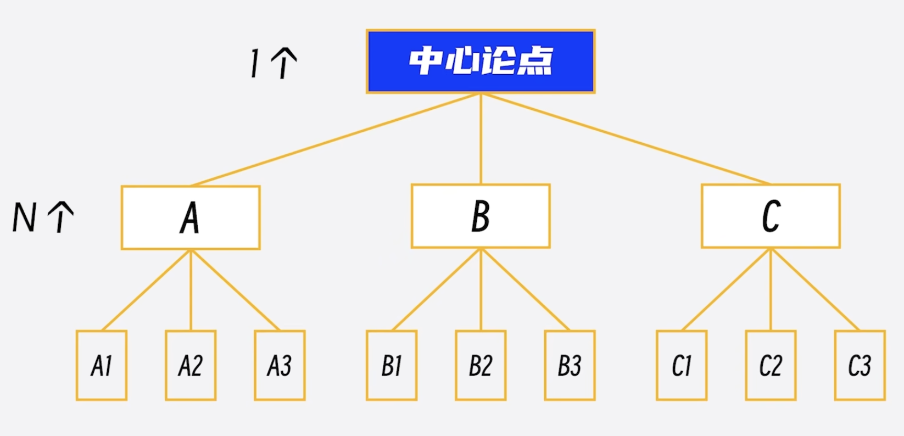
 ##### 从外看要做到“形似”。
 就是表达的结构，他必须能组成金字塔，也就是要从一个中心论点开始逐层展开，这是金字塔原理最基本的要求。

 ---
 # 4 汇报前-设计汇报框架
 ##### 向里看要做到“神似”
 就是要真正符合金字塔结构的一些列标准和规则。有三个规则是必须要符合的，这三个规则务必要牢记。因为不仅汇报的整体框架需要符合这三个必须，汇报的内容和语言表达也都需要符合这三个必须。
 ##### 第一个必须：任意层次的思想，必须是对其下一层思想的总结概括 
我们先看第一个必须：任意层次的思想，必须是对其下一层思想的总结概括。 这很好理解，比如上一层是食物，下一层就必须都是具体的食物（蛋奶/水果/蔬菜），不能出现非食物的物品。

---
# 4 汇报前-设计汇报框架
##### 第二个必须：每组中的思想必须属于同一个逻辑范畴
第二个必须：每组中的思想必须属于同一个逻辑范畴。这其实就是将思想归类分组，如果某组的第一个思想是做某事的原因，那么该组中的其他思想必须是做这件事的其他原因；，如果某组的第一个思想是做某事的第一个步骤，那么该组中的其他思想必须是做这件事的其他步骤。
有一个简单的方法可以检查分组是不是合适，就是能不能用一个名词来表示该组所有的思想，比如说问题、原因、建议、改进方法、步骤等这样的名词。
需要注意的是，每组中的思想，除了属于同一个逻辑范畴之外，还需要符合MECE原则。

---
# 4 汇报前-设计汇报框架
MECE是“Mutually Exclusive Collectively Exhaustive”的缩写，中文意思是“相互独立，完全穷尽”。用大白话说，就是不重复，不遗漏。
这怎么理解呢？这里看个例子，比如对人这个概念有四组分类。第一组：男人和未婚的女人；第二组：老人和女人；第三组：男人和女人；第四组：老人、中年人、未成年人。 其中只有第三组符合MECE原则。
对于汇报而言，MECE原则中，最不能违反的是不重复这个标准，因为一旦有重复，就会让人觉得逻辑混乱；至于不遗漏，有时候为了突出重点，还需要故意遗漏一些不重要的内容，所以要灵活判断，别太较真。

---
# 4 汇报前-设计汇报框架
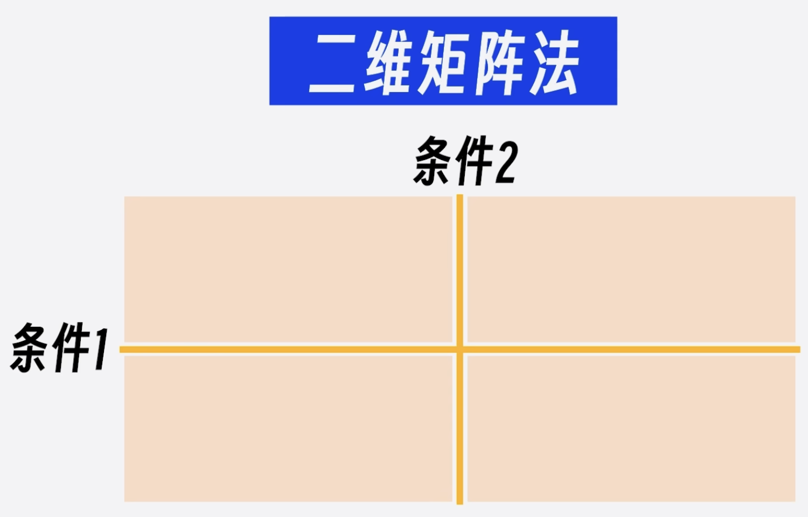
这里，再分享一个极简的MECE表达方法，就是**二维矩阵法**，找到事物的两个条件，横竖各画一条线，分成四个象限，这四个象限分别分析，是一定符合MECE原则的。

---
# 4 汇报前-设计汇报框架
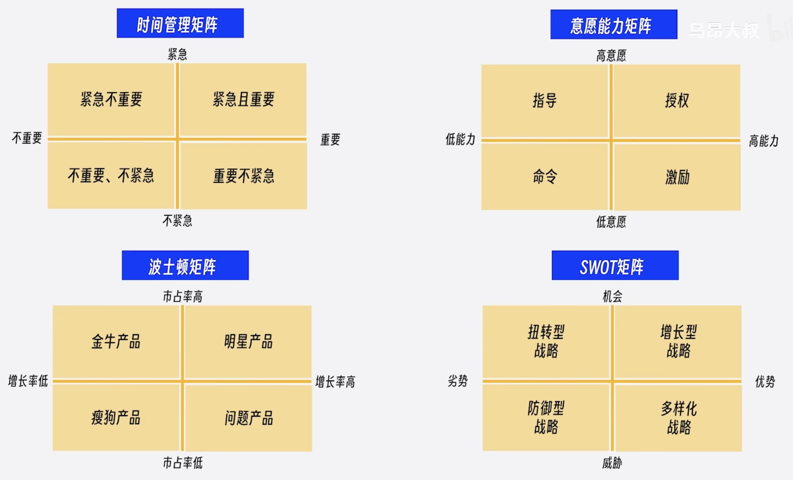
有很多知名的方法论，用的就是这个方法，比如：
艾森豪威尔的时间管理矩阵，就是从重要和紧急两个维度去分析，判断我们处理事情的优先级顺序；
管理者常用的意愿能力矩阵，就是把员工从意愿和能力两个维度分析，找到不同的管理策略；

---
# 4 汇报前-设计汇报框架
咨询界鼎鼎大名的波士顿矩阵，是从市占率和增长率两个维度分析，找到不同的产品策略；
战略规划中常用的SWOT矩阵，是从内部能力和外部环境两个维度分析，找到不同的竞争战略。
这样的例子其实还有很多，在汇报中可以尝试用一下这个方法，领导可能会眼前一亮，

说完了第二个必须，再来看看第三个必须。
##### 第三个必须：每组中的思想必须按照逻辑顺序组织
也就是每组中的思想，谁在前谁在后，同样是有讲究的，不能乱。好在这顺序只有四种，非常好记。

---
# 4 汇报前-设计汇报框架
###### 第一种：时间（步骤）顺序
比如昨天、今天、明天，第一步、第二步、第三步，......
###### 第二种：结构（空间）顺序
比如上、下、左、右，东、西、南、北，......
###### 第三种：程度（重要性）顺序
比如最重要、次重要，......
###### 第四种：演绎顺序
比如问题、原因、解决方案，......

---
# 4 汇报前-设计汇报框架
对于大多数人，前三种顺序一看就明白，第四种演绎顺序可能陌生一点，不过别被“演绎”这两个字唬住了，所谓演绎顺序就是一种线性推理的方式，简单地说，就是后一个思想是由前一个思想推导出来。
汇报中最常用的演绎顺序就是问题、原因、解决方案。 不谈问题，问题原因就不成立；不说原因，解决方案就没有依据；就是这么一步一步的推导。
到这里，金字塔原理最核心的内容就讲完了。
简单总结一下，金字塔原理要掌握三个“必须”、MECE原则、四个逻辑顺序。这些内容比较多，也不容易记得住，可以归纳总结为16个字：结论先行、以上统下、归类分组、逻辑递进。 在设计框架时，金字塔原理的这些标准可以当成检查单来使用，只要汇报框架符合这些标准，那我们的汇报就会让听众觉得逻辑清晰，条理分明。

---
# 4 汇报前-设计汇报框架
**金字塔原理实践案例**
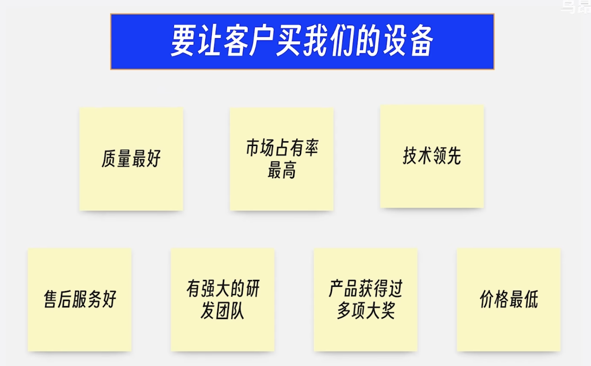
假设我是一名生产设备的销售，想让客户购买我们的生产设备，我的中心论点是：要让客户购买我们的设备。因此就有如下7个理由。
这7个理由放在同一层，明显太多了。

---
# 4 汇报前-设计汇报框架
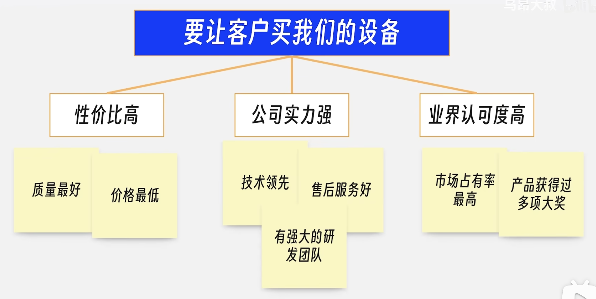
这时候，就需要根据第二个必须把他们分组，分为三组。

---
# 4 汇报前-设计汇报框架
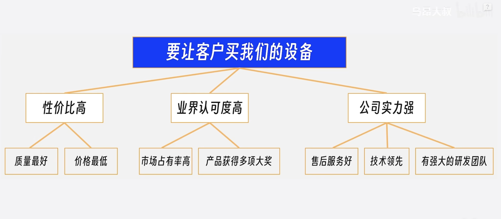
分好组之后，根据第三个必须，按照重要性调整一下顺序。
当然第三层也要按重要性调整一下顺序。

最后调整后的汇报框架，就是一个符合金字塔原理的框架。

但是仔细看一下这个框架，虽然逻辑清晰，但也就那样。
如果我们自己是客户，凭这个汇报框架，还真不一定购买生产设备。

---
# 4 汇报前-设计汇报框架
### 4.3.2 满足听众的期待和价值诉求
因此，用金字塔原理能够帮助我们梳理汇报逻辑，让汇报逻辑清晰，但这还不够。
汇报框架还要有吸引力。

这个时候，在第一步设定目标和第二步分析听众中做的工作就要派上用场了。
汇报的目标和对听众的分析，必须体现在汇报框架中。怎么体现呢？
可以参考三个常用的规则：
#### 建议1：汇报框架的第以层（汇报的中心论点），就是你设定的汇报目标。
#### 建议2：汇报框架的第二层（支撑中心论点的第二字子论点），要覆盖听众的期待和价值诉求。
#### 建议3：框架内的逻辑顺序和内容选择，要兼顾听众的熟悉程度和态度。

---
# 4 汇报前-设计汇报框架
我们还是来看看前面的例子，汇报的目标，是要让客户购买我们的生产设备，这个目标就是汇报框架的中心论点。
假设在分析听众时，发现听众最关心两个问题，一是新设备能不能为公司产生更多的经济效益，二是新设备能不能尽快用起来，不耽误出货。
那汇报框架的第二层就要覆盖掉这两个问题：我方设备能带来更多经济效益；我方设备能在短期内熟练使用。
接下来就要找能支撑这两个论点的论据。
回头看一下前面讲的七个理由，可能会觉得，这些对支撑这两个论点似乎没什么帮助，对的，前面的理由都是从自身角度出发的，现在要站在客户的角度重新看一下这七个理由，找一找对客户有价值的地方。

---
# 4 汇报前-设计汇报框架
质量最好，对客户的好处是什么呢？减少设备停机概率，避免经济损失。
市场占有率最高，对客户的好处是市场上使用这款设备的公司最多，招募操作人员很容易。
技术领先，对客户的好处是，使用新技术，能将设备加工良品率提高到X%，同时提高加工的效率Y% 。
售后服务好，对客户的好处是，出了问题，我们随叫随到，任何问题两个小时之内解决。
有强大的研发团队，对客户的好处是我们可以支持合理的功能优化需求。
产品获得过多项大奖，对客户的好处是由权威人士为客户的决策背书。
价格最低，对客户的好处是比起同类产品更便宜，能直接节约成本X%。

---
# 4 汇报前-设计汇报框架
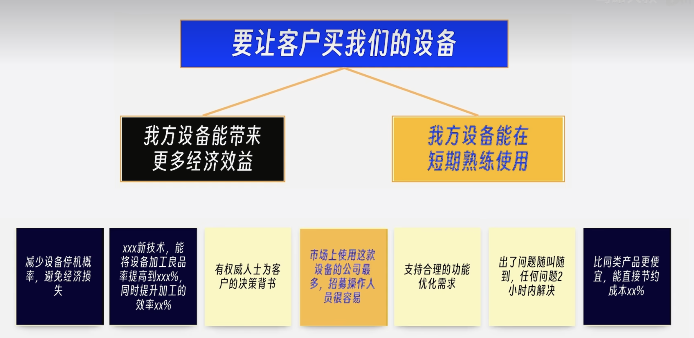
那这些从客户的视角出发，重新寻找的理由能支持好第二层吗？
我方设备能带来更多经济效益有三个论点支撑。
我方设备能在短期内熟练使用 只有招募操作人员很容易能够支撑，而且支撑力度还不太够。

---
# 4 汇报前-设计汇报框架
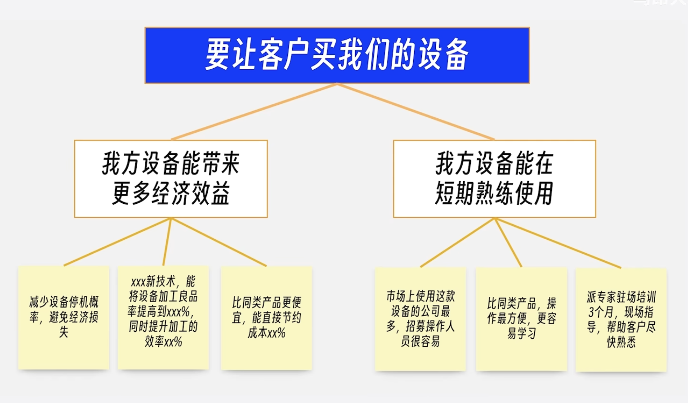
我们需要找找其他论据，比如，和同类产品比，我们的设备操作是最方便的，最容易学习；我们还能派专家现场培训三个月，帮助客户尽快熟悉设备的操作。
现在框架的内容已经能够覆盖掉客户的主要期望了。

---
# 4 汇报前-设计汇报框架
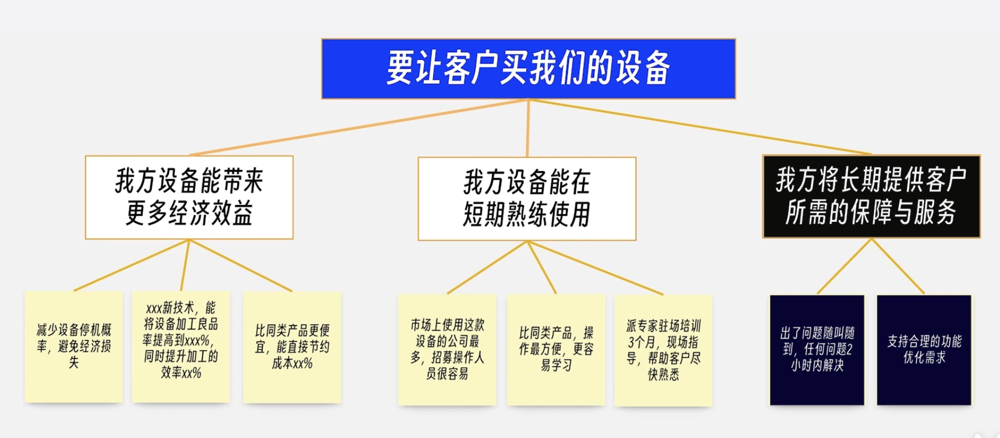
但我们还可以多做一步，给客户增加一个长期保障，让他安心。

---
# 4 汇报前-设计汇报框架
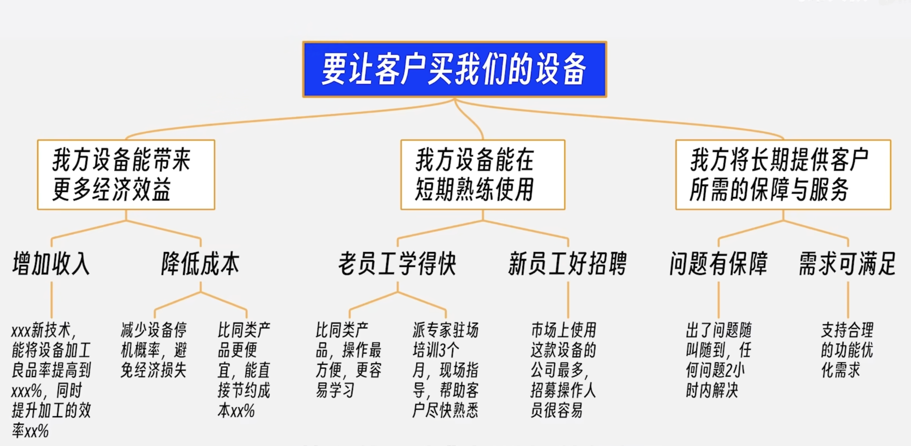
最后，我们按照金字塔原理的三个必须调整一下这个框架，就得到了最终版的汇报框架。

最终的这个框架和前面的多个框架相比，已经有了很大的不同。
如果你是客户，会为那个框架心动呢？

---
# 4 汇报前-设计汇报框架
到这里，设计框架的方法就介绍完了。一共有两个重点：
1.金字塔结构能让表达清晰；
2.汇报框架要覆盖听众的价值诉求；

---
# 5 汇报前-充实内容
前面一直有强调，汇报本质上是影响听众的一个机会。前三个步骤一直在为影响听众做准备：
第一步，设定目标，就是要搞清楚影响谁，影响到什么程度；
第二步，分析听众，就是要弄明白听众关心什么；
第三步，设计框架，就是要解决如何围绕听众的关心来组织信息。
这三步，对影响听众打下了很好的基础，但还不够，还有个核心问题要解决：听众凭什么相信我们？
脱离信任谈影响，那是云彩里盖房子，空中楼阁。当然，如果你曾经给听众留下过非常靠谱的印象，那对听众信任你肯定是有帮助的，但大多数情况下，我们和听众没有交集，我们需要在短短几十分钟，甚至短短几分钟内解决信任问题。
那怎么解决呢？就四个字：有理有据。

---
# 5 汇报前-充实内容
相信大家都听过“有理有据”这四个字，那这四个字意味着什么呢？简单来说，所谓有理，就是逻辑上说得通；所谓有据，就是事实上有根据。有理有据就是逻辑与事实完全一致，相互印证。
当逻辑与事实不一致的时候，是不可能产生信任的。
## 5.1 如何做到有理有据？
那么在汇报中，如何做到有理有据呢？
### 5.1.1 如何做到有理？
我们先看，如何做到有理？有两大武器：逻辑推理和借助权威
#### 逻辑推理（演绎推理）
上期我们讲到了演绎推理，演绎推理是一个重要的逻辑推理形式，它能够提供高度确定性的结论，前提为真，而且推理过程有效，那么结论一定为真。
所以在汇报中使用演绎推理这种逻辑形式，能非常好地增强听众的信任，大家一定要掌握这种推理形式。至少要掌握汇报中常用的演绎逻辑：问题-》原因-》解决方案。这不仅对汇报很重要，对解决问题也非常有帮助。
虽然演绎推理很好用，但也不可能事事从头推导，这不现实，我们更常用的方法是借助权威。

---
# 5 汇报前-充实内容
#### 借助权威
一个不能被忽略的现象是人普遍信任权威，这里边有心理因素的影响，也有现实因素的考量。
从心理因素看，信任权威能降低人的认知负担，给人带来安全感。
从现实因素看，权威有专业知识，有资源优势，还有长期实践的支撑，确实结论正确的概率更高。
有四种权威结论是经常出现在汇报中的

---
# 5 汇报前-充实内容
##### 第一种，科学的结论
比如说，物理学中的能量守恒定律、熵增定律，生物学中的自然选择学说，心理学中的马斯洛需求层次理论，......
这些多数人都听说过，更多的科学理论可能没被大众听说过，那这个时候，就要引用相关的论文来支撑自己的观点。
##### 第二种，致命的方法论或权威机构的研究成果
比如说，大家沟耳熟能详的PDCA戴明环，上一节讲到的金字塔原理，还有麦肯锡，GARTNER的报告都属于这种。

---
# 5 汇报前-充实内容
##### 第三种，名人名言
比如说，《道德经》中的“天下大事必做于细，天下难事必作于易”，《荀子.修身》中的“道虽迩，不行不至；事虽小，不为不成”
##### 第四种，权威认证
比如说，ISO认证，PMP认证，这些常用来证明公司或者个人的能力。

请注意啊，逻辑推理和借助权威并不是二选一的关系，经常结合在一起使用。
比如说，我们逻辑推理的起点很可能是某个专家的结论。

---
# 5 汇报前-充实内容
说完了有理，怎么做到有据呢？
### 5.1.2 如何做到有据？
也不外乎两个办法，看整体和看个例。
看整体，就是寻找对对群体影响的证据，通常用统计数据来体现；
看个例呢，就是寻找对个例影响的事例，通常用故事和案例来影响。
比如你说某个产品很受欢迎。可以用销售增长率和市场份额这两项统计数据来证明，看，这就是整体。
同样的，也可以讲述几个客户使用该产品后的真实反馈来证明，这就是看个例。
当然，用统计数据需要注意数据的来源和权威性，保证数据真实可靠与事实一致。在讲述案例的时候，可以使用对比数据和真实的故事来增强可信度。
请注意啊，看整体和看个例，并不是二选一的关系，经常组合起来使用。
统计数据能让听众看到全局，具体案例能让听众发现细节。
把他们组合在一起，效果才是最好的。

---
# 5 汇报前-充实内容
## 5.2 怎么让“理”和“据”保持一致？
现在有了“理”，也有了“据”，那理和据必须保持一致才能做到有理有据，那怎么才能保持一致呢？
答案就两个字：真诚。
前面也说了，有理有据的核心是逻辑与事实达成一致。
如果你真是这么想的，也真是这么做的，那这两个天然就是一致的，根本不需要去费力硬凑。
如果两者不一致，那说明其中有一部分是编的，那这是汇报的大忌，这是在拿自己的职业前途去赌。
请记住，真诚才是获取信任最好的方法，所以在缺乏事实的时候，我们可以只谈逻辑；在缺乏逻辑的时候，也可以只谈事实。
这虽然不完美，但远远好过胡编乱造。

---
# 5 汇报前-充实内容

到这里充实内容的方法和技巧就讲完了。我们在用一个简单的例子来练习一下。
假设你是一位项目经理，公司有新项目要启动，你希望能负责这个项目，你可以准备哪些材料来争取这个项目呢。
根据我们前面讲的内容，可以从有理有据两个部分来寻找支撑材料。
先看有理部分（逻辑推理，借助权威），你需要一个逻辑推理的过程，得出“我能带领团队，成功完成新项目”这个结论，比如下面这个推理过程：

---
# 5 汇报前-充实内容
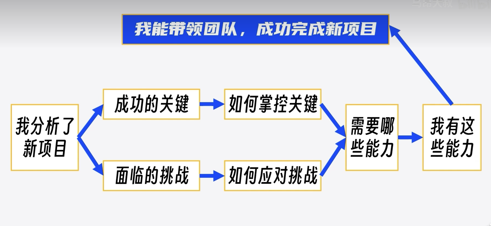
我分析了新项目；我找到了新项目成功的关键，我也识别了新项目面临的挑战；
根据分析，我知道了如何掌控关键，以及如何应对挑战，在分析出要做到这些，需要什么样的能力。
再来看看我自己，我具备这些能力，因此我能带领团队成功完成新项目。
我们也可以使用借助权威这个策略来找到一些只层材料，比如说有PMP认证，有对项目管理的十大过程领域非常熟悉。

---
# 5 汇报前-充实内容
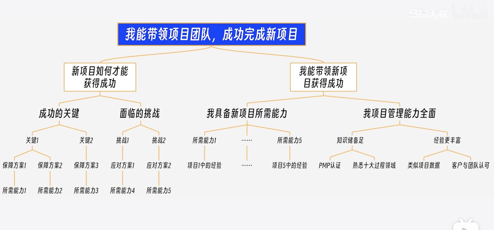
说完了有理，再来看看有据（看整体，看个体）的部分，从整体上可以找到哪些材料呢？比如说，我做过项目的历史绩效数据，那这个可以用来证明你项目管理的综合能力；从个例上也可以寻找一些材料，比如说，我在某个相似的项目中应对过问题的具体经验，可以用来证明我们具有某个关键能力，客户、项目成员对你的评价，可以用来证明我们的管理能力。

---
# 5 汇报前-充实内容
找到这些材料，把他们组织在一起，就能够非常有好的支撑你的观点，左侧是一个示例，可以参考。

有了内容支撑，我们的汇报材料在信息上已经很完整了，不过啊，要做到影响听众，汇报材料依然有优化的空间，下一步就需要调整优化了，让听众更容易理解我们的汇报。

---
# 6 汇报前-调整优化
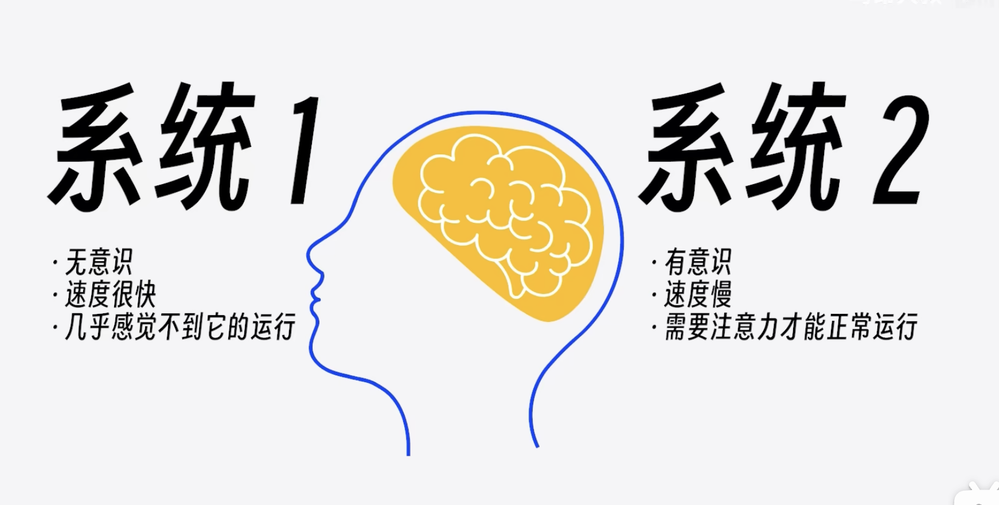
尽管前四个步骤，汇报中常见的问题解决的差不多了，只剩下一个问题：能不能让听众听得懂？
怎么才能让听众听懂呢？要想让听众听懂，就先要让听众的直觉听懂。
这里是不是有点疑问，让听众听懂比较好理解，让听众的直觉听懂是什么意思？
要讲清楚这个问题，就需要补充一个非常重要的心理学知识，已故的心理学家、诺贝尔经济学家得主丹尼尔.卡尼曼在他的《思考.快与慢》中为我们展示了一个非常重要的心理学研究成果，人由两套思考系统：

---
# 6 汇报前-调整优化

系统1的运行是无意识的，速度很快，不怎么费脑力，几乎感觉不到它的运行。
比如当我们看到屏幕上这张图片，瞬间就能感受到愤怒.

---
# 6 汇报前-调整优化

系统2与系统1完全相反，需要集中注意力，他才能正常运行，
比如当我们看到屏幕上这道题，我们可能需要算半天，甚至还需要借助草稿纸才能算出来。

---
# 6 汇报前-调整优化

系统1，我们称之为直觉；
系统2，我们称之为理性。
可以把直觉和理性想象成大脑中住着的两个小人儿，平常我们的决策都是这两个小人儿合作的结果，尽管我们都希望理性的这个小人儿能在思考中占主导地位，让我们时刻保持头脑清醒、逻辑严密、善于决策，但事实上，那个叫“直觉”的小人儿才是大脑中的直觉，平时都是他在决策，只有他遇到麻烦了，他才会呼叫“理性”出来帮忙。

---
# 6 汇报前-调整优化

而“理性”这个小人懒得出奇，他一点也不愿意多付出，只有在遇到一些非常重要的事情时，他才出面，而且他出来时间长了，你的脑力会被快速消耗，从而感到疲惫，所以，哪怕是那些看似“理性”的小人做出的决策，实际上也都是在只觉得引导下才完成的。不信的话，我们来测试一下右面这个问题。

---
# 6 汇报前-调整优化
生活中，能说明直觉主导决策的例子更多。
比如我们啥短视频的时候，不知不觉一小时就没了，在这个期间完全是直觉在主导我们的决策，为什么会这样？这就是进化带来的特性。
干体力活也好，还是思考也好，身体都要遵循“最省力原则”，用最少的能量来处理事情，不管你喜欢不喜欢，都是逃不开这个特性的。
但我们总会发现一些人非常善于思考，时刻都能保持理性，难道这些人不受制于“最省力原则”吗？同样受制于这个原则，区别在于他们展现出来的理性是通过长期的练习，把理性系统擅长的事变成直觉系统也能做的事情。
这就像开车、有用、骑自行车一样，刚开始学的时候，是都需要理性来参与的，可一旦学会了、熟悉了，靠直觉也能完成。
总之，在人类大脑中，“直觉”才是老板，“理性”顶多算个顾问，老板遇到麻烦了，才会找顾问出来解决，而这个顾问支撑不了多久，很快就懒得听了。
让听众的“直觉”听得懂，现在大家应该知道了。

---
# 6 汇报前-调整优化

汇报，要跟老板谈，怎么让听众的直觉听懂呢？
就是让我们的理性去说服听众的直觉。
什么意思呢？就是把困难留给自己，用你最好脑力的理性系统思考清楚，然后对着听众最节能的直觉系统进行一通输出。
用你的理性系统思考清楚，对着听众的直觉系统输出。
总结成十个字就是：理性化思考，直觉化表达。

---
# 6 汇报前-调整优化
前面四个步骤，其实是一直都在引导用理性系统进行思考，只要真的完成了前面的步骤，理性化思考就已经做得差不多了。
到第五步，调整优化的重点是**集中宝贵的脑力，动用理性系统，完成直觉话表达的改造**。怎么做呢？
斯坦福大学组织行为学教授奇普.希思和他的弟弟丹.希思合著了《行为设计学-让创意更有粘性》一书，在这本书中，他们总结了六大原则：***简单、意外、具体、可信、情感、故事*。
这六大原则就是直观化表达最有利的武器。

---
# 6 汇报前-调整优化
**原则1：简单**
直觉系统喜欢简单，因为这样符合最省力原则，但简单不是断章取义，而是要你的表达简短，且深刻。
那些广为流传的金句普遍都有这个特点，比如：时间就是金钱，知识就是金钱。 简短，但却蕴含深刻的含义。
所以呀，我们的汇报材料要尽量做到简单。提炼核心的内容，删掉冗余的句子，直达听众的内心。
有一个常用的办法，直接引用金句或套用金句模式。比如刚才提到的知识就是力量，可以模仿这个句子写一堆，比如：健康就是财富，创新就是生命，平凡就是幸福，教育就是未来，......

---
# 6 汇报前-调整优化
**原则2：意外**

设置意外的目的，是吸引听众有限的注意力，把他们拉回到汇报中。
但请注意啊，并不是让你不顾一切的制造意外，汇报中的意外还需要在“情理之中”，这就需要开动我们的脑力，寻找“意料之外，情理之中”的观点、数据、案例......
如果啊，实在不知道怎么设置意外，有一个比较保险的方式，就是自问自答。比如年终汇报，你要展示团队的业绩，可以像右边这么说。
看，这就是一个最简单制造意外的办法，第一，听汇报的的人默认都是听，没想过会被提问；第二，人都有好奇心，听到问题就会好奇问题的答案，看，注意力这不就来了吗。

---
# 6 汇报前-调整优化
**原则3：具体**
“直觉”只擅长处理具体的事务，对于数字、理论这种抽象的概念不敏感。所以在汇报中要尽量将抽象的东西具象化，数字和大段的文字可以转换为图表，我们常说的文不如表，表不如图，说的就是要具象化。
抽象的逻辑关系，也可以画成图形，屏幕上就是一些逻辑图形的示例，抽象的概念可以用类比来辅助理解。
比如：黑洞就像一个强大的吸尘器，它的强大引力可以吞噬周围的一切，包括光。
不过大家要记住，一切类比都是不当类比。就业是说类比只能用来辅助理解，不能用来判断对错。
所以啊，使用类比时也要注意听众的思维偏好，面对那些比较擅长理性思考的人，可以尽量少用甚至不用，比如埃隆.马斯克就不喜欢类比的方法。

---
# 6 汇报前-调整优化
**原则4：可信**
听众的直觉产生怀疑的时候，他们的理性会跳出来审查你的内容，如果上一步你已经做的有理有据，那可信的基础已经做的比较扎实了，这一步，你只需要把PPT做的像点样子。
这里要提一下光坏效应，先入为主的信息，会影响对事物整体的判断，听众在一开始看到一个像样点的PPT，他会更容易相信你说的内容，至于如何做一个像样点的PPT，网上的资源和工具比较多，就不啰嗦了。

---
# 6 汇报前-调整优化
**原则5：情感**
关于情感，心理学界有两大共识：（1）人类是先有情绪，后有的认知；（2）情绪的作用比认知的作用强大。
人类有很多的认知行为，都因为有情绪的参与而事半功倍，比如你现在回忆一件让你印象深刻的事情，你看看其中是否有情绪的参与。虽然在职场汇报这个场景下，人人都觉得更应该理性，但情感的影响依旧非常强大，有很多经常在汇报中出现的词汇都暗戳戳地向听众传达着积极的情绪，比如：成功、胜利、丰收、希望、梦想、乐观、勇气、信心、学习、成长、进步、团结、奋斗、坚韧不拨、永不放弃......
所以， 可以放心地在汇报中增加情感的部分，尤其是面对女性听众的时候，比如，可以强调企业共同的价值观、社会责任感、企业对行业的贡献，也可以感谢团队的支持和领导的栽培。
只要是发自内心的感受，听众都会有共鸣的。

---
# 6 汇报前-调整优化
**原则6：故事**
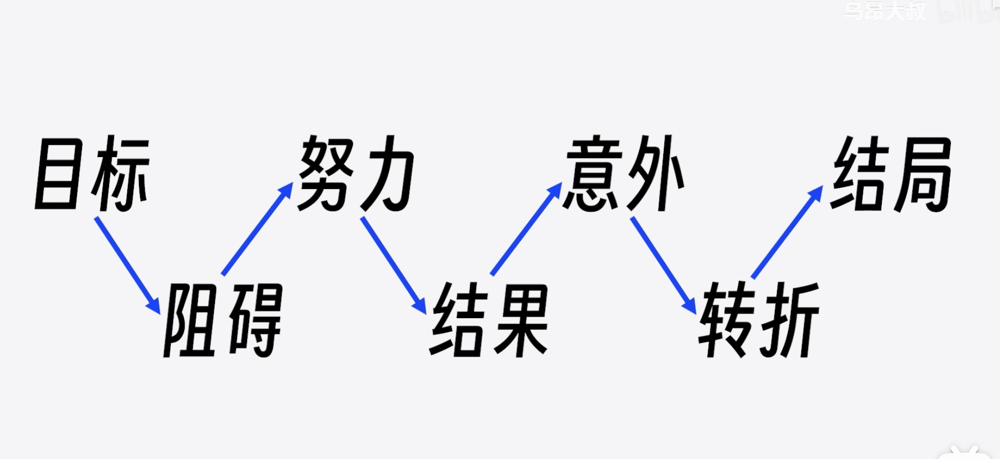
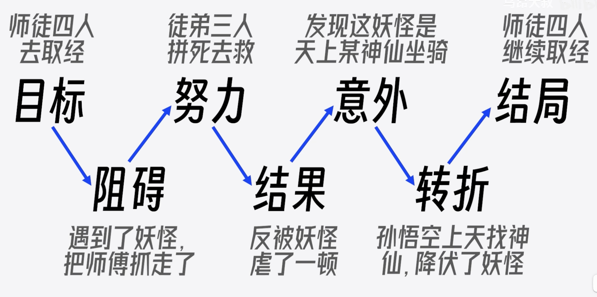
听故事是人的天性，比起听道理，人更喜欢听故事，故事比道理更能影响人的思维。
在今天这个时代，会讲故事的人，他的机会会更多。上一期讲过，你曾经做过的案例，都可以用故事的方式讲出来，如果不知道怎么把案例变成故事，那就可以参考编剧们常用的故事万能公式（右图）。
记不住这七个步骤也不要紧，我们都看过西游记，西游记九九八十一难，几乎都是这个套路。

---
# 6 汇报前-调整优化

简单、意外、具体、可信、情感、故事，这六大原则就讲完了。
希望大家能记住这六大原则，因为这六个原则，除了在汇报中常用，在写作、演讲、讲课、广告创意、营销传播、商务谈判等等，只要是与人交流的事情中都非常常用，

