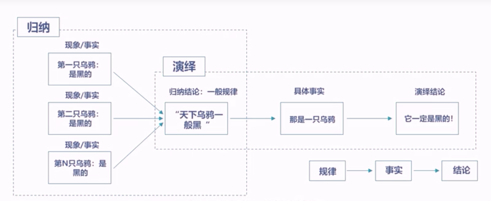

<!-- _paginate: skip -->

# 逻辑思维
我们经常听人说到，这个人讲话很有逻辑，思考问题很有逻辑，这个人讲话一点逻辑都没有，到底什么是逻辑？什么是逻辑思维？那如何培养自己的思维逻辑？

---
# 1 逻辑思维概述
## 1.1 关于逻辑思维的一些故事
**李约瑟之谜**
据有关资料，从公元6世纪到17世纪初，在世界重大科技成果中中国所占的比例一直在54%以上，而到了19世纪，骤降为只占0.4%。中国与西方为什么在科学技术上拉开如此之大的距离。为什么资本主义和现代科学起源于西欧而不是中国文明？
李约瑟从科学方法的角度得到以下答案：
一是中国没有宜于科学成长的自然观；
二是中国人太讲究实用，很多发现滞留在了经验阶段；
三是中国的科举制度扼杀了人们对自然规律探索的兴趣，思想被束缚在古书和名利上，“学而优则仕”成了读书人的第一追求。

---
# 1 逻辑思维概述

李约瑟还特别提出了中国人不懂得数字管理，中国儒家只注重道德而不注重定量经济管理。

**爱因斯坦关于西方科学和古代先哲的观点**
爱因斯坦也认为：
西方科学的发展以两个伟大的成就为基础：一是是希腊哲学家发明的形式逻辑体系；二是通过系统的实验发现因果关系的方法；中国古代的先哲没有走上这条路。

## 1.2 逻辑思维的知识大纲
#### 逻辑思维的基本概念
概念、命题、推理

---
# 1 逻辑思维概述

#### 逻辑思维的基本定理
同一律、矛盾律、排中律、充足理由律
#### 逻辑思维的三大推理
归纳推理、演绎推理、类比推理
#### 逻辑思维的有效论证
论证的概念、论证的结构、论证的规则

---
# 2 逻辑思维的基本概念
2.1逻辑思维 （Logical thinking）**
人们在认识事物的过程中借助于**概念、判断、推理**等思维形式能动地反映客观现实的理性认识过程，是人们把握具体事物的本质规律，认识客观世界的思维方式。

**概念**
是反映事物本质属性或特有属性的思维形态。**概念是知识的细胞**。在人类所认知的思维体系中最基本的构筑单位。是把所感知的事物的共同本质特点抽象出来，加以概括形成的单词。例如：动物、社会、自然、金属、学校、国家等。

**命题**
**命题是表达判断的句子**。例如：中国是一个发展中国家。一般把判断某一件事情的陈述句叫做命题。
其中判断为真的语句叫做**真命题**，判断为假的语句叫做**假命题**。命题的表现方式是句子。

---
# 2 逻辑思维的基本概念
**推理**
推理是由一个或几个**已知的判断**（前提）推出**新判断**（结论）的过程。
例如：所有人都会死——苏格拉底是人——所以苏格拉底会死。
逻辑的研究中心是推理，**推理由命题构成**，是命题群和命题序列。
推理由**前提、结论、推理形式**三大元素构成。

---
# 3 逻辑思维的基本规律
**同一律**
**在同一思维过程中所使用的概念或判断要保持自身的一致性**。
例如：世间万物中，人是第一个宝贵的。我是人。因此，我是世间万物中第一个宝贵的。就违反了同一律，犯了偷换概念的问题。

**矛盾律**
**在同一思维过程中，两个互相否定的思维不能同真，必有一假**；
例如：这个山洞从来没有人进去过，进去了的人也从来没有出来过。即肯定了“所有人都没有进去过”，又肯定了“有的人曾经进去过”。这就是自相矛盾，违反了矛盾律。

**排中律**
**在同一思维过程中，互相矛盾的思想不能同假，必有一真**；
例如：在讨论是否应该禁烟时，某人说：“我不赞成禁烟，烟草可是国家的一项重要产业。我也不赞成不禁烟，毕竟吸烟危害人的健康。”就违反了排中律。

---
# 3 逻辑思维的基本规律
*排中律和矛盾律的区别*
排中律指的是命题要么为真，要么为假，不存在中间状态。
矛盾律则表明任何命题与其否定命题不能同时为真。

排中律强调了一个命题的真假只有两种可能，即命题要么成立，要么不成立，不存在第三种情况。例如，“今天是星期一”这个命题要么为真，要么为假，没有其他可能。这个原理在形式逻辑中是基本的。
矛盾律则强调了命题与其否定之间的互斥性。如果一个命题为真，那么它的否定命题就必然为假，反之亦然。例如，如果命题“A是B”为真，那么命题“A不是B”就必然为假。这个原理也是逻辑推理的基础之一。

---
# 3 逻辑思维的基本规律
区分这两个原理的关键在于，排中律关注命题本身的真假可能性，而矛盾律则关注命题与其否定之间的关系。排中律强调了命题的确定性，而矛盾律强调了命题之间的对立性。

在逻辑学中，排中律和矛盾律通常是构建逻辑体系的基础原理。它们在形式逻辑和哲学思考中都具有重要作用。例如，在哲学讨论中，排中律被用来说明命题的确定性，而矛盾律则被用来推导出其他逻辑规则。

**排充足理由律**
**充足理由律是指在论证中，论题的成立必须有充足理由**，即第一要求有论据，第二要论据真实，第三要从论据能推出论题。常见的违反充足理由律的方式有“理由不相干”和“夸大相关程度”两种形式。

---
# 4 逻辑思维的三大推理
## 4.1 归纳推理
归纳法就是由**N个已知的数据或现象**，推论出一个**规律**。归纳法是一种从**特殊到一般**的推理方式，它是我们观察客观世界，寻找现象背后的共性，提炼知识理论的科学方法。
即：
```
现象一 

现象二     --->  结论

现象N
```

---
# 4 逻辑思维的三大推理
## 4.1.1 完全归纳
完全归纳推理的前提是**无一遗漏地考察一类事物的全部对象，断定该类中每一对象都具有（或不具有）某种属性，结论断定的是整个这类事物具有（或不具有）该属性**。
太平洋已经被污染；大西洋已经被污染；印度洋已经被污染；北冰洋已经被污染：（太平洋、大西洋、印度洋、北冰洋是地球上的全部大洋）所以，*地球上的所有大洋都已被污染*。

## 4.1.2 简单枚举归纳
简单枚举归纳推理是列举某类事物中一部分对象的情况，根据没有遇到矛盾的情况；便做出关于这一类事物的一般性结论的推理。
例如：天鹅会飞，麻雀会飞、乌鸦会飞，所以得出结论，所有的乌都会飞

---
# 4 逻辑思维的三大推理
## 4.1.3 科学归纳推理
科学归纳推理是以科学分析为主要依据，由某类中部分对象与其属性之间所具有的因果联系，推出该类的全部对象都具有某种属性的归纳推理。
例如：猫、狗等小动物进入这个石灰岩洞中时就会倒地死去。该洞地面沉积着大量的二氧化碳，地面附近缺少氧气，因此猫、狗等头部靠近地面的小动物进入洞中会倒地死去。因此，凡是头部靠近地面的小动物进入洞中都会倒地死去。

归纳法对人类的发展是非常重要的，从培根到罗素，再到后来的逻辑实证主义，经验论思想家都认为科学知识是建立在归纳法的基础之上的，也就是大量的观察和实验的基础上进行科学归纳，最后得出规律。比如物理学、化学、天文学，这些规律、定律和公式都是这样获得的。

---
# 4 逻辑思维的三大推理
## 4.2 演绎推理
演绎推理是由**一般到特殊**的推理方法。推论前提与结论之间的联系是**必然**的，是一种**确实性推理**。

演绎法最重要的两个东西是：**第一性原理**和**三段论**。

## 4.2.1 直言三段论
```
大前提   --->  小前提   ---> 结论
```
eg：所有的人都会死  --->  苏格拉底是人   ---> 苏格拉底会死


---
# 4 逻辑思维的三大推理
## 4.2.2 假言三段论
**是以假言判断为前提的推理**。也叫条件论证，是一个包含“**如果......,那么......**”结构的论证。
例如：如果我要有钱了，那么我会带你去夏威夷度假。我现在有钱了，所以我带你去度假。
## 4.2.2 选言三段论
**以选言判断为前提的推理**。
例如：针对控烟条例的投票，你要么支持，要么反对。你现在投反对票了，所以你就要支持控烟，不要吸烟。

---
# 4 逻辑思维的三大推理

所以，平时在表达、沟通、思维过程中，经常会用到，这一次，我们算是找到根基了。
要学习逻辑思维，帮助自己更好的发现自己逻辑思维的漏洞，同时，修正自己的逻辑，让自己的思维更富有逻辑。
这是我们的演绎推理三段论。

---
# 4 逻辑思维的三大推理
## 归纳和演绎之间的关系
演绎是从规律开始推出结论；归纳是从现象开始得出规律。这两个之间是相辅相成。

我们未来在沟通、表达或思维的过程中都是这两个环环相扣，不断进行组合的一个过程，科学家也是这样的。

演绎离不开归纳，因为演绎推理的前提是规律，规律需要通过归纳才能获得。
归纳也离不开演绎，因为为了提高归纳的可靠程度，需要运用已有的理论知识，对归纳个别性进行提前分析，把我因果性、必然性，都会用到演绎推理。
所以两个相辅相成，都很重要。

---
# 4 逻辑思维的三大推理
## 4.3 类比推理
**类比推理是根据两个或两类对象有部分属性相同，从而推出它们的其他属性也相同的推理**。
例如：科学家研究鱼的特性，发明了潜水艇

科学上的许多重要理论，也是通过类比推理提出来的。
现代科学技术中，有很多模型方法都是基于类比推理，比如说由实验模型类推到研制原型；现代工程技术试验，模型试验由自然原型类推到技术模型、现代仿生学。
康德说过，每当理智缺乏可靠论证的时候，类比这个方法就能指引我们前进。
类比推理我们要做到触类旁通，举一反三，交叉学科、边缘学科都是通过这个类比产生的。 看别人反省自己，我们看看有什么相似的地方，有没有向别人学习的地方，快速地去进步。

---
# 4 逻辑思维的三大推理
类比推理也有自身的劣势，特别容易犯代表性偏差影响。也就是根据表面的相似性做出错误的决策。
比如小张和我是一个地方的，也毕业于同一所大学，那小张开饭店赚了好多钱。于是我相信，我去开个饭店也能赚好多钱。
实际上能不能赚到钱，取决于你和小张的相似程度，毕竟赚钱是天时地利人和，市场是千变万化的，等你把饭店开起来，可能已经赚不到钱了。
成功学很喜欢用成功人士的例子来激励学员，学员听的是热血沸腾，以为自己有梦想就能成功，但其实成功是由选择、努力、运气、梦想、环境、时机等多因素相互组合的结果，不是单向因素决定的。

---
# 5 逻辑思维论证
## 5.1 什么是论证？
**论证就是用一个或一些已知为真的命题确定另一命题真实性或虚假性的思维过程**。
论证的主要构件包括论点、论据和论证方式。
## 5.2 论证的结构
```
论据
论据    ---> 论证方式   --->论点
论据
```
论据通过论证方式得出论点

---
# 5 逻辑思维论证
### 5.2.1 论点
论点是一个明确的判断，是作者或者某些人的一个完整陈述，表示肯定或者否定的判断句式，明确的表态性的一个句子，是一个人的主观判断。

**什么是论题呢？**
论题是议论的话题，论点是在论题的基础上形成的。
论读书就是一个论题，他没有对错。读书使人进步，大家通过讨论这个论题，最后得出的论点，
论题没有对与错，论点是带有指引性的对与错的。

---
# 5 逻辑思维论证
### 5.2.2 论据
一般，论据有事实论据和理论论据

**事实论据**就是一些事实或者统计数据这一类的。
**理论论据**是经过实践检验的，为社会公认的一些理论，比如说包括这个社会科学理论、哲学理论、自然科学的一些原理、定律、公式、谚语、名言、警句、名人名言、权威专家，这些都是理论论据。
所以，一个是事实，一个是理论，找论据的时候，就要这么去找，找事实、找理论来支持你。

---
# 5 逻辑思维论证
当然，找到的论据是有力度的，有的论据比较强，有的比较弱。在逻辑学上，有一个专业的术语，叫论据的支持度，一个推理的论据支持度是百分之百，那前提是真，结论一定是真；繁殖一个推理的论据支持度小于百分之百，那前提是真，结论也不一定是真。
能够提供百分之百论据支持度的，叫必然性推理；低于百分之百论据支持度的，叫或然性推理；

一般来说，演绎推理就是必然性推理，归纳、类比推理都是或然性推理。
论证方式是论点和论据之间的联系方式，他回答的问题是如何用论据论证论点。
论证方式本质上是一种推理关系，由于论证的理由有多个，而每一个理由对论点的支持关系可能不同，所以在一个论证的过程中有多种论证方式，比如说归纳、演绎、推理，可能为了完成论证，用多个东西组合在一起。

---
# 5 逻辑思维论证
## 5.3 论证的规则
规则1：论题应当清楚、确切
规则2：论题应当保持同一
规则3：论据应当是真命题
规则4：论据应当比论题更可信
规则5：从论据应能推出论题

---
# 5 逻辑思维论证
## 5.4 做好论证、识别推理的一些建议
如何做好论证？如何识别推理？
建议1：分清事实和观点，找到坏推理和好推理之间的区别。
事实是对客观发生或存在、可证实事物的描述；
观点分为评价和规范，评价又分态度和判断。
案例1：因为本市已经出现70例新冠确诊病例（事实），我认为现在出门是一件很危险的事（判断），我不想让你出去参加同学聚会（态度）、如果你非要去参加，先去酒店隔离14天再回家吧（规范），家里有四个老人（事实），而老人特别容易被感染（判断）。

---
# 5 逻辑思维论证
案例2：坏推理，没有逻辑关系。如：北京的交通这么拥堵（有很多原因），主要是因为车太便宜了。如：那家店那么多人排队吃饭，饭菜的口味一定好。

日常中我们很多人特别相信“人多就是真理”，只要人多买的东西就是好东西，这就是一个非常错误的推理方式。
有时候也是对的，毕竟要是我们识别外面的世界，都需要严谨的逻辑推理，这是非常困难的，有时候根据一些简单的现象做一些判断，如果这些事情对我们的生命或者影响不是太大的话，有时候有一定的作用在里面，这也是为什么很多人愿意相信“人多就是真理”。

---
# 5 逻辑思维论证
### 坏推理的分类
结构缺失（论题不一/没有前提/没有结论）
不相关（前提、假设、结论之间没有必然联系）
不可接受（前提和假设有争议，有歧义，不值得信赖）
不充分（前提、假设不能完全支持结论）

---
# 5 逻辑思维论证

在斯蒂芬.罗宾斯 和 玛丽.库尔特合著的《管理学》这本书里，认为概念能力是高层管理能力最重要的能力，超过了人际能力和技术能力。就是就高层能力更应该具备概念能力，这种逻辑能力其实是一种抽象思维能力，

---
# 6 后言
逻辑思维，是一个人认识客观世界，理解自然现象和社会现象的一个非常基础的工具，使我们思维表达、沟通的一个重要工具，可以帮助我们更好地解决问题，同时还可以培养批判性思维和创造性思维。
逻辑思维提供的一些列理论、工具、方法是我们提升认知能力和思维能力的非常重要的工具，他也在完善我们的知识架构，也是联合国规定的七大基础学科之一，它对我们哲学素养和文化素养的提升是非常非常有帮助的。
我们很多人在学习金字塔原理、思维导图等等，如果我们没有逻辑思维作为底层的根基，相信大家都不一定能够真正把握住这些工具的精髓。
所以，大家要对逻辑思维有一个真正深刻的认识，了解逻辑思维的底层根基、底层工具和底层方法，了解论证、了解规律，这样我们才可以真正具备逻辑思维的能力；分析问题、解决问题，才能有真正逻辑；讲话、表达、演讲，才能真正有逻辑，这就是逻辑思维。


