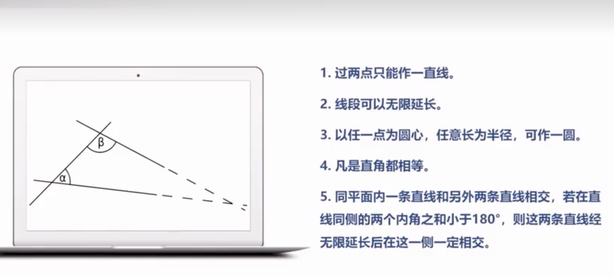

<!-- _paginate: skip -->

# 第一性原理

---
# 1 关于第一性原理的故事
**马斯克的第一性原理的故事**
埃隆•马斯克 Elon Musk，被誉为硅谷钢铁侠，在美国可谓是家喻户晓，是继乔布斯之后最有冒险和创新精神的硅谷大佬。他在补
互联网：Paypal          火车界：Hyperloop
能源界：SolarCity       科技界：OpenAI
汽车界：Tesla           太空界：移民火星
航空界：SpaceX          脑科学：Neuralink

再一次采访中，有人问马斯克为什么能够在如此多的学科取得如此多的成就呢？马斯克回答说：那可能是我掌握了第一性原理吧。于是第一性原理就火了，火遍了创业圈。

---
# 2 第一性原理的概念
第一性原理，有两个概念，一个是哲学概念，一个是物理学（量子力学）概念。
## 2.1第一性原理的哲学概念
哲学概念是亚里士多德提出来的，他认为：第一性原理是基本的命题和假设，它不能被省略，不能被删除，也不能被违反。
也就是说在每个系统中都存在着最底层的根基，不能把最底层的东西挖掉删掉。

关于亚里士多德，他是逻辑学的奠基人。逻辑学有两个最重要的工具，一个是第一性原理，一个是三段论。 第一性原理作为底层的根基，三段论就是不断不断地往上推导。亚里士多德也是形式逻辑学的奠基人。

---
# 2 第一性原理的概念

希腊数学家**欧几里得**受到亚里士多德的思想影响。把形式逻辑的公理演绎方法应用于几何学，从而完成了数学史上的重要著作《**几何原本**》。在西方是**仅次于《圣经**》而流传最广的书籍。

《几何原本》就是采用公理化方法，找到一个最底层的第一性原理。这个第一性原理就是5条公设。正因为这些最基础的共设，就奠定了整个几何学大厦。

---
# 2 第一性原理的概念
## 2.1第一性原理的物理学（量子力学）概念
广义：一切基于量子力学原理的计算。
狭义：不使用经验参数，只用电子质量，光速，质子中子质量等少数实验数据去做量子计算。

关于第一性原理和经验参数，这是两个极端。第一性原理是根据某些硬性规定，纯理论的一种推演；而经验参数是通过大量的实例做出的一个规律性的数据。正好是两个极端。

---
# 3 第一性原理的本质——演绎性思维
第一性原理倡导的是推演，也就是找到一个最基础的东西，不断地往上去推演。第一性原理是推演，所以它的本质就是一种演绎思维。
我们的思维方式基本有这么几种：归纳、演绎、类比，还有溯因。最常见的就是归纳和演绎。
什么是归纳呢？就是由N个已知的数据和现象推出一个结论。比如说欧洲的天鹅是白色的，亚洲的天鹅是白色的，......，我们就归纳出所有的天鹅是白色的。
演绎法是什么呢？就是根据一个最底层的东西，往上推导。演绎法最厉害的就是三段论，如经典三段论（大前提-》小前提-》结论），问题式三段论（现象what-》原因why-》解决方案how）。
演绎性思维的有点是只要前提正确，后面的就一定正确。 归纳就不行了，归纳正确的前提是样本量不够多，覆盖所有空间和时间的。

---
# 3 第一性原理的本质——演绎性思维
**一个思想实验**
如果让你去盖一个50层高的房子，现在旁边有一个20层的房子，你有两种可以选择。第一种选择是在这20层房子之上，再加盖30层；第二种选择是重新找一个地方，找一个能够承载50层楼重的大石头，重新盖一个。你会怎么选择呢？
其实会发现，第一中选择，会有很多限制，相反第二种就不受任何限制了。
这也就是第一性原理的好处，也就是跳出原有的经验参数，重新建立出一套新的标准。盖楼有一半成本都是在地下，可以看到地下东西的重要性，我们要找到一个大石头，打好一个地基往上面改，那就非常容易了。

---
# 3 第一性原理的本质——演绎性思维
现代有很多科学家在发现世界的规律，他们也提出了很多第一性原理，
泰勒斯：水是万物本原
牛顿：万有引力  惯性
爱因斯坦：光速恒定原理  相对性原理
达尔文：遗传变异    自然选择
经济学：看不见的手
柏拉图：理念论
政治学：人人生而平等
美国的整个国家都是建立在宪法基础之上的，宪法是建立在独立宣言基础之上，独立宣言的第一句话就是人人生而平等。 所以人人生而平等就是美国政治学的第一性原理。

---
# 3 第一性原理的本质——演绎性思维
爱因斯坦说过：”理论家的工作分成两步，第一步是发现公理，第二步是从公理出发推出结论“。
查理芒格在《穷查理宝典》说到：”商界有一个古老的法则，第一步找到一个简单的基本的道理；第二步非常严格地按照这个道理行事。“
......
这说明第一性原理是无比重要的，做任何事情首先要找到第一性原理，然后往后推导就容易多了。

---
# 4 第一性原理的哲学根基
本体论：探究世界本原或基质
简一律：根本的那个律
第一因：最早的那个动力因
科学家都是追求简洁，找到根本。比如物理学上的几次理论大变革，都与之有关，像哥白尼、牛顿、爱因斯坦都是在削去理论和客观事实的累赘之后，找到了精炼的，无法在精炼的科学理论。
第一因是源于第一推动力，这个宗教的词汇，第一推动力是牛顿创立的。牛顿的第一定律说明物质在不受外力的作用下将保持静止或匀速直线运动；牛顿认为，在宇宙之初，所有的万物都是静止不动的，是上帝推了一把，才有了现在运动的星系，所以他把第一因也叫做第一推动力。

---
# 5 第一性原理的价值和意义
**让我们透过现象看本质**
在《教父》这个电影里，马龙.白兰度有一句关于**把握本质**话非常经典，“那些花半秒钟就看透事物本质的人，和花一辈子都看不清事物本质的人，注定是截然不同的命运”。也就是说，只有看清事物本质的人，才可以真正找到问题、解决问题。
就像乔布斯所说：“只有看到事物本质的人才能够拥有改变世界的力量”。当遇到苦难的时候，不要总是盯着别人怎么做，要回归本质去思考问题，比人做的也不一定对。
第一性原理有一个暗示，不要老想着站在别人的肩膀上，有可能别人站错了地；我们不是说不要站在比人肩膀上，而是要先看看他有没有站对，如果站队了，就站在他肩膀上前行，会更棒；如果站错了地，要换个地，找个对的地儿站上去会走得更远；当让这样从头开始可能很寂寞、困难，但是他可以支撑你看的更高，走得更远。
这就是第一性原理可以帮我们看清本质，把我背后的那个东西。

---
# 5 第一性原理的价值和意义
**颠覆性创新**
看看埃隆马斯克的例子，他创办了超级高铁——hyperloop。众所周知，现在目前世界上最快的高铁是在中国、德国和日本，基本上已经达到了三百多到四百多公里，如果马斯克站在这个基础上再去创办高铁，他想超过中国、德国，会有很大的难度。
因此他就从第一性原理出发，开辟了一种新的方式使用真空管道，通过真空管道没有摩擦力，速度就可以很快。
这就是他跳出了原有的技术参数和经验，重新从零起步换了一种方式把现有方式颠覆了。
还有马斯克的超级隧道、电动车特斯拉、以及车的广告营销。

---
# 6 如何应用第一性原理
使用第一性原理，有三个步骤：**归零 ——> 解构 ——> 重构**
归零，就是从头回归最基本的概念，寻找最基本的基石，
结构，就是用物理学的思维分解现象，层层拨开找到改变的突破点，
重构，就是重新建造一个新的赛道、模式和方法，把原来的颠覆掉、替换掉。

这里看看埃隆马斯克如何使用第一性原理构造了特斯拉汽车。
众所周知，特斯拉电动汽车的续航里程可以达到五百公里以上，其核心技术室电池，而电池对核心的是储能和充电效率。
电池组的价格非常规，每千瓦时六百美金，一台汽车最少要85千瓦时，相当于5万美金（人民币大概30多万）的成本，再加上其他的组件太贵了，老百姓买不起。

---
# 6 如何应用第一性原理
所以，埃隆马斯克就思考如何把电池的价格降下来？
（1）**归零**：不在原来成熟的电池技术上研发。（2）**解构**：解构电池的内部组成结构。电池是由铝、镍，还有一些聚合物组成的，原材料只需要80美金，能不能重新组合一下，降到原来的十分之一？（3）**重构**：重新组合，节约成本。重新建立内部的化学反应。 最终经过技术人员的努力，研发出了新的电池组，降低成本，提高了电池储能和充电的效率。

还有乔布斯第一性原理-苹果。（1）**归零**：重新发明手机。（2）**解构**：解构手机组成部件。（3）**重构**：重组手机部件。（几万个零部件重新组合布局，改动最大的是去掉键盘，使用触摸屏技术）
还有链家地产重塑销售流程。

---
# 6 如何培养第一性原理思维
跨学科学习是发现第一性原理的最好方法。任何一个学科都有其局限性，复杂问题能可能涵盖多个学科，单个一个学科的知识是没法解决复杂问题的，且他会限制人的思维方式。
在知识大爆炸时代，不可能学完所有的知识，只要掌握重要学科的重要理论就行了，把重要理论作为基石模型，建立第一性原理和普世智慧。

