<!-- _paginate: skip -->

# 金字塔原理


---
# 引言
也许你有遇到这样的场景：你向领导汇报工作，结果还没说几句话呢，领导就赶了出来，领导感觉你说话逻辑不清晰。那如何提升自己的逻辑思维能力呢？如何提升一下语言表达能力呢。其实在每一个事情的后面都有一些模型和方法，关于这方面，有一个很重要的模型和思维方法——金字塔原理。
金字塔原理，可以帮助我们更好地去表达，更好地去思考，更好地去解决问题。

---
# 1 认识金字塔原理
什么是金字塔？
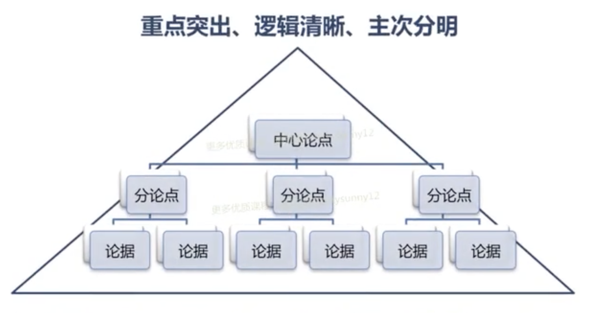

金字塔就是：任何事情都可以归纳出一个中心论点，中心论点可由三至七个论据支持，这些论据本身也可是个分论点，被三至七个论据支持，如此延伸形状如金字塔。


金字塔原理可以解决我们思维的两大障碍，一个是思维混乱，一个是逻辑不清。

---
# 1 认识金字塔原理
大脑思考问题一般有三个阶段：收集信息、分析信息、解决问题。
根据大脑经济性原理，大脑对能量消耗极大，能不用脑就不用大脑。大脑虽然只有3斤左右，但是它每天消耗的能量占到25%到30%，也就是我们大量的能量被大脑消耗了。
因此大脑具备以下特征：
特征1：能不用脑就不用脑。所以很多时候我们都懒得思考，喜欢靠直觉去解决问题。
特征2：能简单就不复杂。人的短时记忆系统一次能够记忆和理解的内容不会超过5（+-）2个，根据最新认知神经科学的数据是41（+-）个，繁多的信息会让大脑迟钝和逃避思考。
特征3：能建立逻辑结构就不机械记忆。如果内容比较多，大脑就需要对思想进行分组和归类，建立一定的逻辑关系存储在长时记忆系统，便于日后提取。对于没有逻辑关系的内容，大脑会很快忘记。

---
# 1 认识金字塔原理
以上的这三个特征，就是大脑的属性，在人类的漫长进化过程中形成的一种竞争策略。
现代社会是信息时代，数字经济，我们大脑对海量的信息感觉无所适从。我们相当于顶着狩猎时代的大脑来应对信息时代，实在是先得拙劣，环境的变化速度，远远超过了我们大脑的进化速度。金字塔原理的出现，相当于帮大脑安装了一个组件，帮助大脑想清楚，说明白，快速的整理思路，高效地表达思想。
这就是金字塔原理符合了大脑的认知逻辑和认知顺序，符合了大脑的思考方式，这也是金字塔原理的魅力所在。

---
# 1 认识金字塔原理
## 1.1 金字塔原理的起源
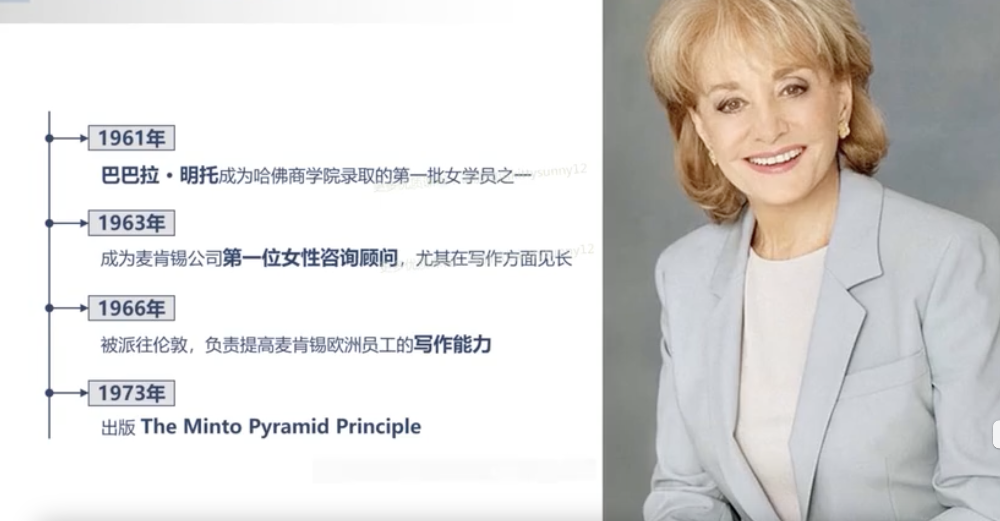
金字塔原理是谁发明的呢？
它最早起源于芭芭拉.明拓，麦肯锡公司的一位女顾问，尤其是写作方面超级厉害，她写出来的PPT、文稿和公司的报告，商业报告都很有逻辑，麦肯锡公司就让他在公司内部给其他人上上课，后来金字塔原理应用而生，金字塔原理也成了麦肯锡新员工进入公司的必修课。

---
# 1 认识金字塔原理
为什么要交金字塔原理呢？
金字塔是目前为止人类建筑中最稳定的建筑，它采用的是52度角和方锥型的体，金字塔的塔面，面与面之间的角度是51度50分9秒，这与自然塌落现象的极限角和稳定角的52度角，相差无比，52度角被认为是最稳定的角。
金字塔就是按照这种稳定角和极限角来建造的，由于金字塔独特的方锥型的造型，刮风的时候对它的破坏力就化解到很小很小的程度了，这种结构可以经历上千年不倒，可以真真体会到埃及的先哲们是多么的厉害。
麦肯锡的芭芭拉.明拓为了说明演讲表达的结构逻辑性像金字塔一样稳固，所以起名为金字塔原理。

---
# 1 认识金字塔原理
## 1.2 金字塔原理的价值
我们每天都在处理信息，大脑就是一个处理信息的器官，不管是写作还是演讲表达，其实都是在处理信息。
金字塔原理最大的价值就是，可以帮助我们在以下三个方面得到提升：
**（1）文章写作**：从文字堆积到层次分明写一篇好文章。
**（2）说服表达**：在与人沟通中，可以说服得更有逻辑，从不善言辞到捷思善讲。
**（3）问题解决**：问题解决就是一个收集信息、处理信息、得出结论的过程；金字塔原理可以帮助我们从混沌无序到思路清晰。

---
# 1 认识金字塔原理
## 1.3 金字塔原理的特征
假如现在有一个秘书，向你汇报工作如左图：
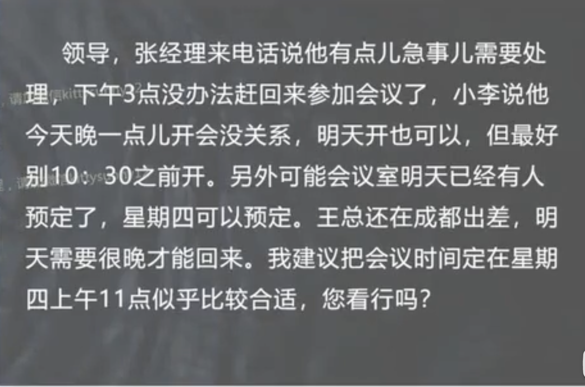
听完之后，是不是感觉乱七八糟。
而面对信息，我们的大脑是能不思考就不思考。

那怎样表达更合适呢？
第一，先说原因还是先说结论？
第二，原因能不能被分类？

---
# 1 认识金字塔原理

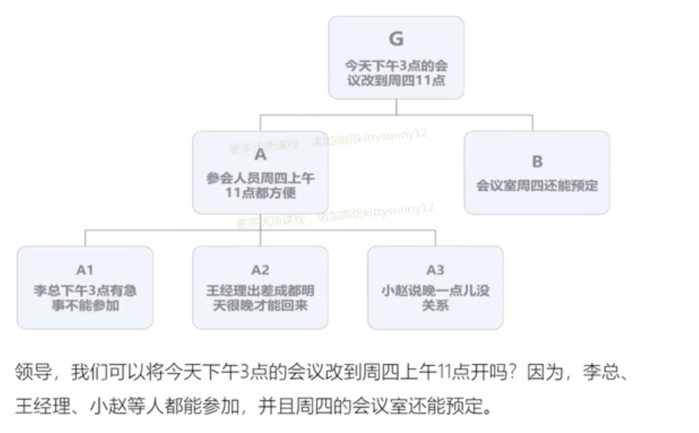
第三，这些原因可以被总结分类吗？
第四，内容表述有顺序吗？

根据上面四个问题，修改汇报结构，换成第二种表达，是不是效果会更好呢。


---
# 1 认识金字塔原理
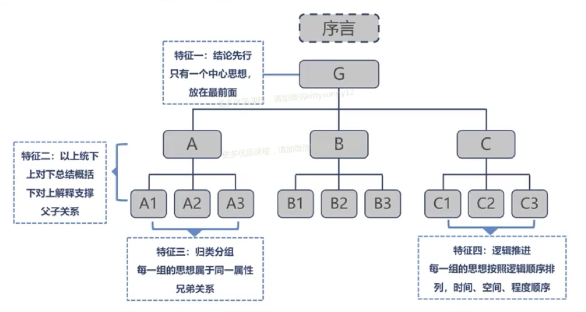
和上面的四个问题相对应，金字塔原理有四个特征：
**特征一：结论先行**：只有一个中心思想，放在最前面
**特征二：以上统下**：上对下总结概括，下对上解释支撑，父子关系
**特征三：归类分组**：每一组思想属于同一属性，兄弟关系
**特征四：逻辑推进**：每一组的思想按照逻辑顺序排列，时间、空间、程度顺序
这四个特征是金字塔原理最重要的核心。

---
# 2 搭建金字塔结构
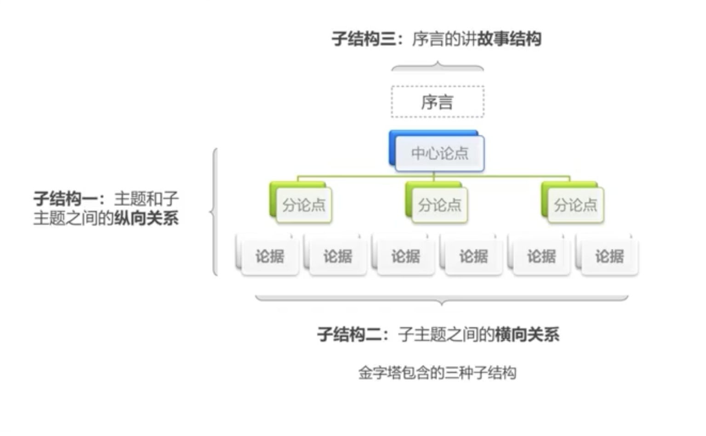
如何搭建金字塔呢？有没有一些方法和工具呢？
搭建金字塔有三种结构：
**纵向结构**，上和下的这种结构
**横向结构**，内容和内容直接组织在一起的结构
**序言结构**，序言就是一个引子

---
# 2 搭建金字塔结构
## 2.1 搭建纵向结构
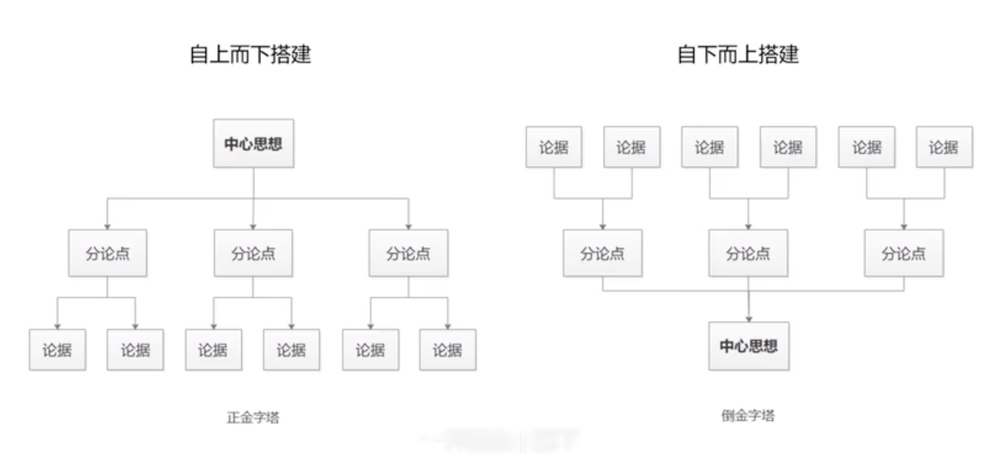
搭建纵向结构，一般有两种方法：自上而下，自下而上。
**自上而下**，就是按照金字塔结构中心思想到分论点，再到论据去搭建，为正金字塔。
**自下而上**，就是从各种论据，到分论点，再到中心思想去搭建，为倒金字塔。

---
# 2 搭建金字塔结构
通常，思考的时候要整理各种信息，最后形成一个结论，所以思考的时候是自下而上。
表达的时候要结论先行，先说结果，所以表达的时候是自上而下。
### 2.1.1 自下而上搭建-整理信息作总结
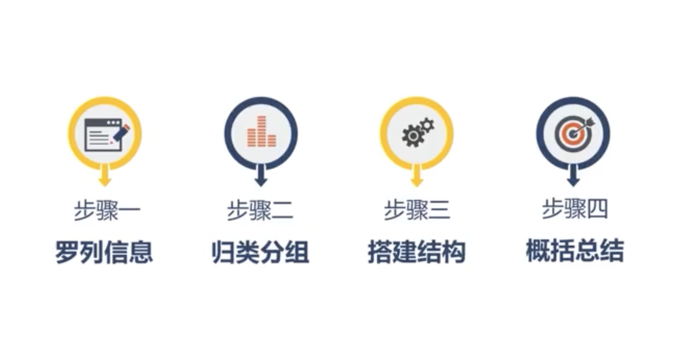
第一步：罗列信息
第二步：归类分组
第三步：搭建结构
第四步：概括总结

---
# 2 搭建金字塔结构
**给同事介绍女朋友时使用金字塔原理的案例**
``你要给同事介绍一个女朋友，女方信息如下：身高170cm，体重50kg，25岁，长得漂亮，一头长发，性格温柔，落落大方，独立自主，有房有车，科技公司主管，名校毕业。``
上面的信息都是碎片化的，如何组织语言搭建金字塔呢？
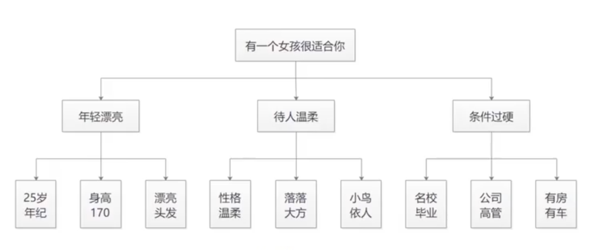

经过分析，运用四个步骤自下而上思考，我们可以搭建一个如右图的金字塔结构。

---
# 2 搭建金字塔结构
### 2.1.2 自上而下搭建-疑问回答做分解
基于前面的例子，可以通过疑问回答式自上而下表达。
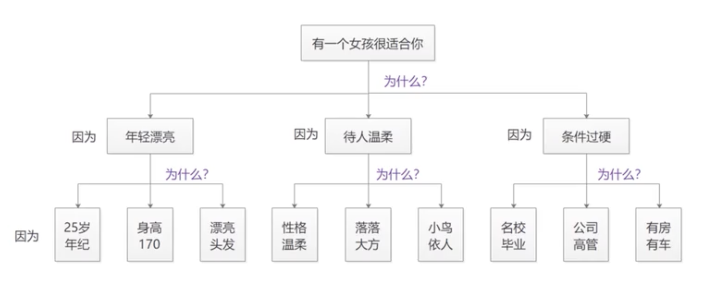
就是问一个问题，回答一下，这样讲会很吸引人，也很有逻辑里。而不是一上来就将最底下的信息，最后给出结论。也就是结论先行，再逐个去分解。

---
# 2 搭建金字塔结构
## 2.2 搭建横向结构
横向结构，主要涉及的关系为演绎和归纳。
演绎推理，是由一般到特殊的推理方法。主要是``大前提，小前提，结论``， ``现象，原因，解决方案`` 这样的推理过程。
归纳推理，归纳法是一种从特殊到一般的推理方式。由N个已知的数据或现象，推论出一个规律。
任何信息都不是能随便组织在一起的，它有它的逻辑关系。那我们把信息组合在金字塔里面之后，他们怎么排序呢？

---
# 2 搭建金字塔结构
也就是说，横向组织信息的时候，信息之间的关系怎么排？
一般来说，有三大顺序：**时间顺序**、**空间顺序**、**程度顺序**。
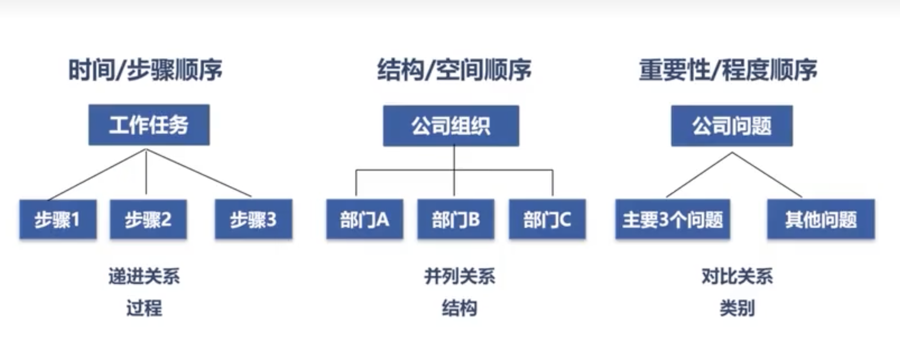
关键是我们要找到哪种方式最合适，哪种理解起来最简单。


---
# 2 搭建金字塔结构
**分享旅游见闻时使用金字塔原理的案例**
``假如你现在去新马泰旅游了一圈，回来之后，大家希望你上台分享一下自己的见闻``
十分钟的时间给到你，应该如何分享呢？
我们需要构建一个逻辑架构，按照下的时间顺序、空间顺序、程度顺序三种架构介绍。
其中程度顺序，按照听众的关注程度进行排序。

---
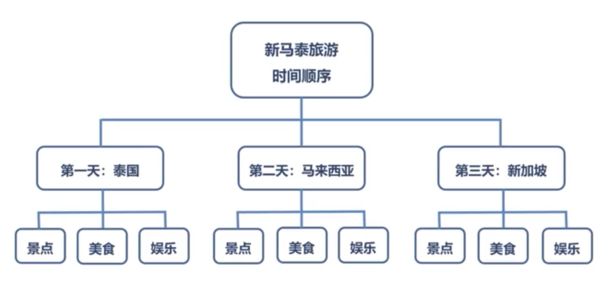 &nbsp;&nbsp;
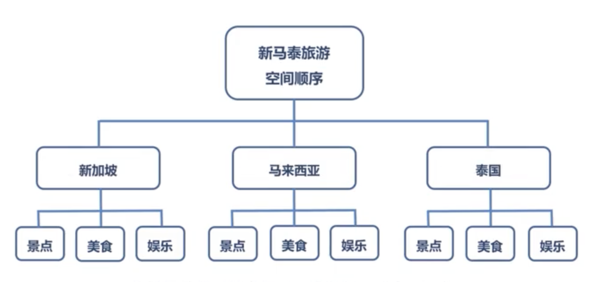 &nbsp;&nbsp;
 &nbsp;&nbsp;

---
# 2 搭建金字塔结构
**讲礼仪时使用金字塔原理的案例**
讲礼仪也可以有逻辑关系，可以按照如下不同的方式讲：
（1）按照时间，拜访前、拜访中、拜访后
（2）按照空间，餐桌礼仪、办公室礼仪、餐厅礼仪
（3）按照程度，着装（先讲女式着装，再讲男式着装）

---
# 2 搭建金字塔结构
## 2.3 分类（MECE法则）
信息只有分类后，才能排序。那这么多内容，怎么分类呢？分类也有一些原则和方法，麦肯锡公司提出了MECE法则。
### 2.3.1 分类的标准
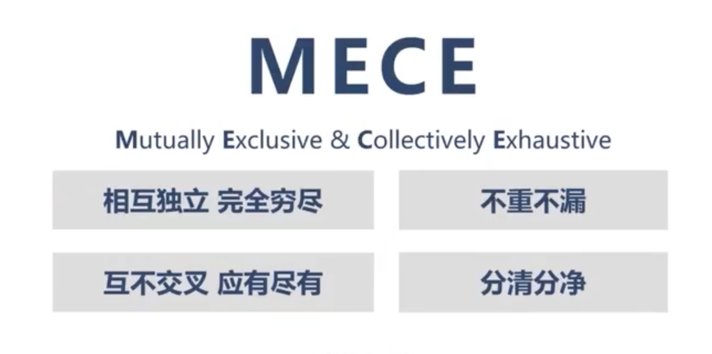
MECE是“Mutually Exclusive Collectively Exhaustive”的缩写，中文意思是“相互独立，完全穷尽”。用大白话说，就是不重复，不遗漏。

---
# 2 搭建金字塔结构
**MECE的一些案例**
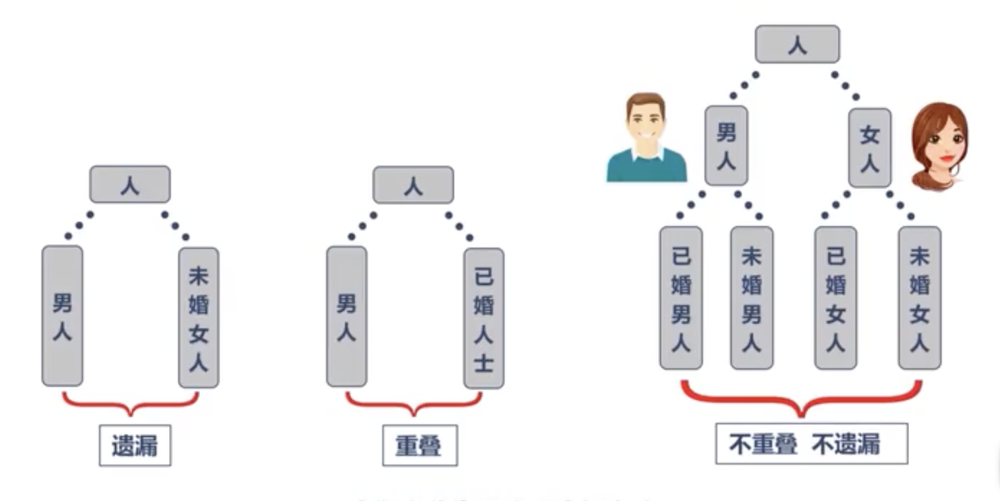
就如右边对人的分类，要做到不重不漏。

MECE法则是一种思维方式，未来不管是我们思考问题、写作、演讲、开会，都可以用到这个方法。
为了让自己在思考、演讲、表达的时候有条理，要经常问自己三个问题：
**问题1**：我有没有遗漏重要内容？
**问题2**：他们之间有没有交叉和重叠？
**问题3**：他们之间的顺序是否正确？

---
# 2 搭建金字塔结构
到这里，我们已经学习了主干内容。
纵向结构，有倒金字塔和正金字塔。
横向结构，涉及的归纳和演绎，最重要的就是时间、空间、程度这种顺序。
同时在分类的时候，还要符合MECE法则。这样才能保证一堆东西，能够很清楚地搭建到金字塔结构里去。
最后一个结构是写序言。

---
# 2 搭建金字塔结构
## 2.4 序言结构
序言结构一般运用SCQA法则，就是将任何一个课程或者演讲之前，要有个导入，就是类似于我们的开场白，开场白的设计就可以运用SCQA法则。
SCQA法则是什么？
***S*** **情景** (Situation):需要让对方产生共鸣，必须让对方听完后产生一种“对，你说的没错”的反应，只有情景被认同了故事才能够继续发展。
***C*** **冲突** (Conflict):是打破了情景中给对方的安全感，推动故事情节发展并引发读者提出疑问的因素。 一般来说，冲突包含三种：人与自然的冲突（eg：洪水、猛兽），人与人的冲突（人与人打架、国家战争），人与自己的冲突（内心跳不出某种心结、纠结等等）
***Q*** **回题** (Question):果是从对方的角度会关心的问题。
***A*** **答案** (Answer):是基于这个问题的答案，也就是金字塔最顶端的中心思想。

---
# 2 搭建金字塔结构
**练习：找出下文中的SCQA**
``如何在风险可控的前提下，促进业务快速发展？近年来，我公司业务得到快速发展，但随着行业市场分化趋势日益明显，我公司业务面临的风险管理压力日益增加。因此，我们应根据区域特点，确定差异化方针政策。``
【情景 Situation】近年来，我公司业务得到快速发展；
【冲突 Conflict】但随着行业市场分化趋势日益明显，我公司业务面临的风险管理压力日益增加；（人与自然的冲突）
【问题 Question】如何在风险可控前提下，促进业务快速发展？
【答案 Answer】我们应根据区域特点，确定差异化方针政策。
因此，可以看到，序言的组织有一些结构和逻辑。

---
# 3 金字塔原理的应用
## 3.1 写作中的应用
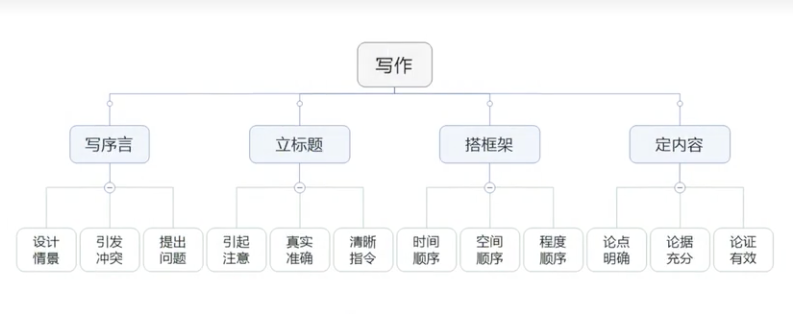
写作的时候，可以按照右边的结构进行书写。

在信息大爆炸的时代，一个好的标题，可以吸引读者的标题，如果一个标题吸引不足的时候，可以采用双标题。
第二个，起名字要真实准确，不要哗众取宠，把标题定的华而不实，名不副实，让读者不知所云。一句话说清一个中心思想。

---
# 3 金字塔原理的应用
**写作中的应用**
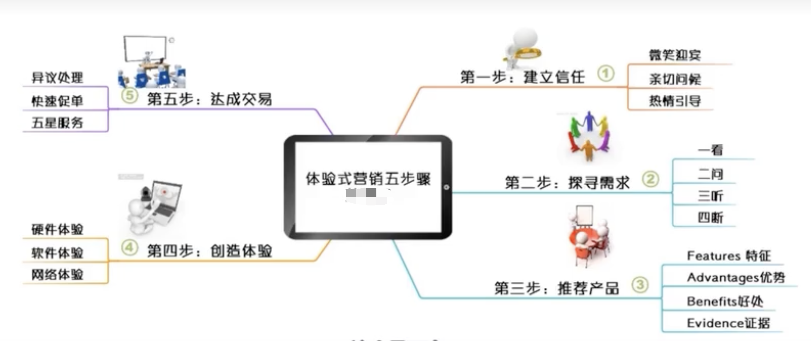


---
# 3 金字塔原理的应用
## 3.2 表达说服中的应用
``假如你房地产的销售人员，并且负责销售豪宅。有一个超级富豪客户，准备委托你买一套豪宅。你也准备推荐一套豪宅。``
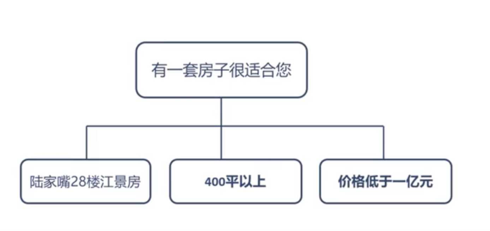&nbsp;&nbsp;
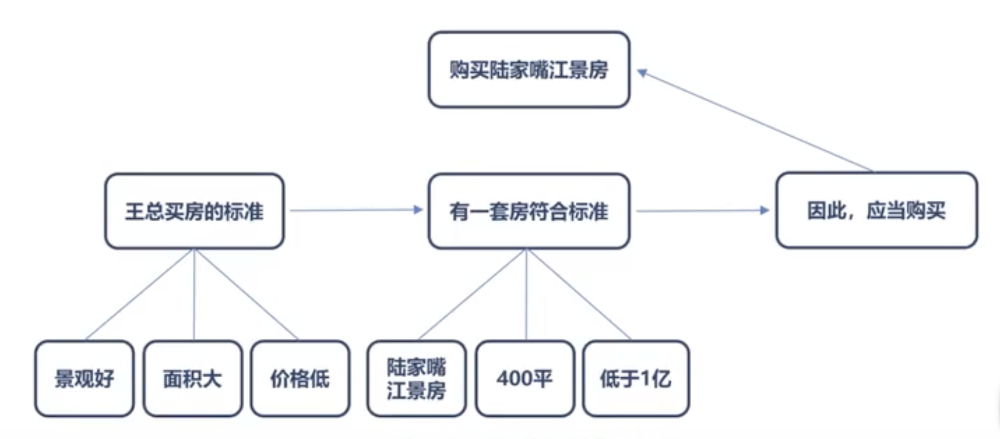&nbsp;&nbsp;
这里给出的两种表达结构。
因此，在说服沟通的过程中，先说论点，再说论据支撑是一种方式；也可以大前提，小前提，到结论这种演绎结构也是一种方式。具体采用哪种根据具体的场景情景来定。

---
# 3 金字塔原理的应用
## 3.3 解决问题中的应用
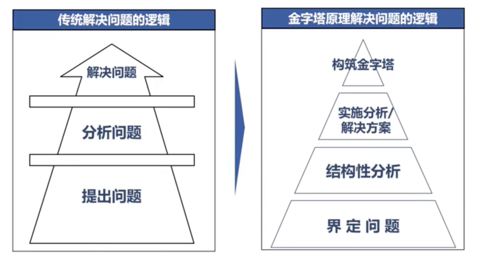
传统解决问题的逻辑是：提出问题，分析问题，解决问题。
金字塔原理解决问题的逻辑是：界定问题，结构性分析，实时分析/解决方案，构筑金字塔。特别强调加入了结构化分析。

---
# 3 金字塔原理的应用
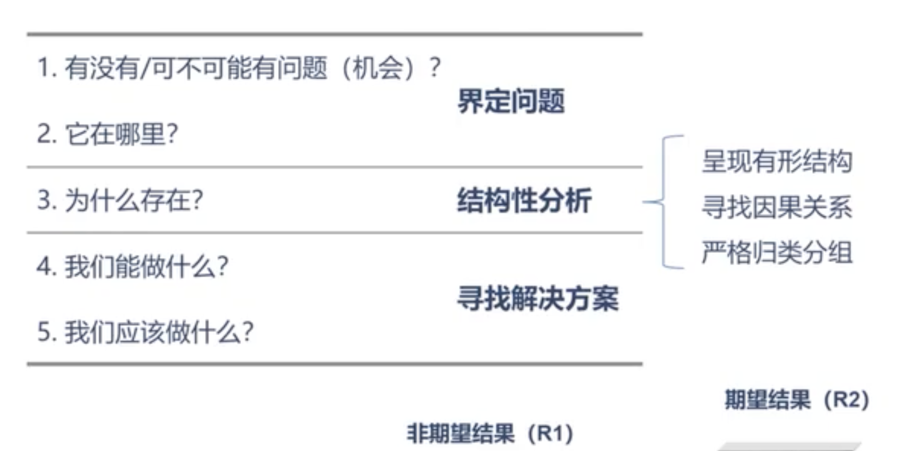
具体来说，金字塔原理解决问题的逻辑可以按照右图中的5个步骤来进行。


---
# 3 金字塔原理的应用
**七步成诗-解决问题七步骤**
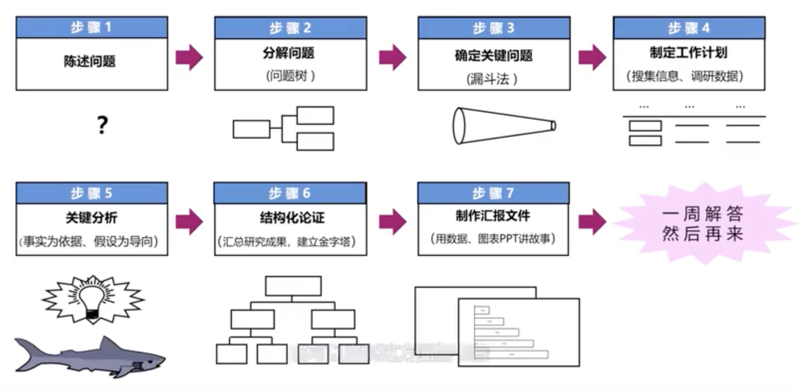
在解决问题的时候，麦肯锡公司有一个工具叫七步成诗，也就是解决问题的7个步骤，非常的经典，他这里面，把金字塔原理运用到了极致。
这里面强调最核心的是结构化分析。

---
# 3 金字塔原理的应用
**火车过山洞案例**：

你开车去送一批货物，途中路过一个限高2米的山洞，但车子连货物有2.05米，怎么办？
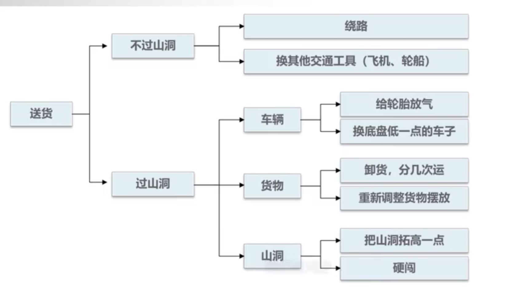

结构化分析之后，可以得到如右图的参考方案。
这么分析写出来的目的只有一个，就是保证我们分析的不重不漏。

---
# 4 如何用好金字塔原理
未来开会的时候，我们要多问：有没有更好的方法了，我们有没有重要的信息遗漏，有没有遗漏最重要的方案，中间有没有重叠来重新分一下。
要想做好结构化分析，我们需要从结构化分析原则、结构化分析框架、三个方面做好。
## 4.1 结构化分析原则
以**事实**为依据，以**假设**为导向，严格的**结构化**。

---
# 4 如何用好金字塔原理
## 4.2 结构化分析框架
**完全穷尽（CE）**
任务：将所思考问题的一切相关因素全部罗列出来
方式：一般采用头脑风暴法
**相互独立（ME）**
比较：对所有相关因素进行相关性比较；
分离：分离不同层级因素；
合并：合并同一层级中相互可以替代的因素，确保各因素的独立性
**逻辑分类**
按照归纳演绎等正确的逻辑关系，将各因素进行排列组合

---
# 4 如何用好金字塔原理
## 4.3 结构化分析工具-逻辑树
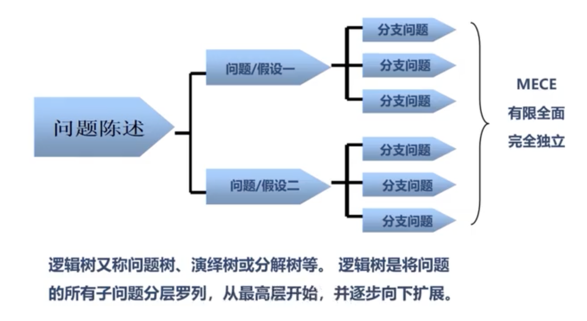
麦肯锡有句话非常经典，世上无难事，只要肯细分，分的不能再分了，这在哲学上叫还原论的方法。

---
# 4 如何用好金字塔原理
**逻辑树的类型**
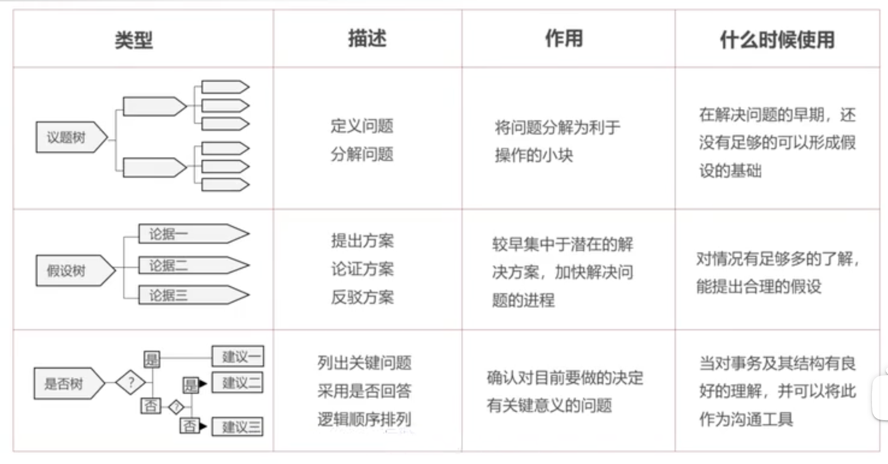

---
# 4 如何用好金字塔原理
总结一下，关于结构化分析，有原则、框架和工具，只有掌握了这些，才可以搭建一个稳定高效的金字塔，帮助我们更好地去解决问题。

金字塔原理可以用在写作、演讲、解决问题上，只要涉及结构化思考的，都可以用金字塔原理。

---
# **金字塔原理**
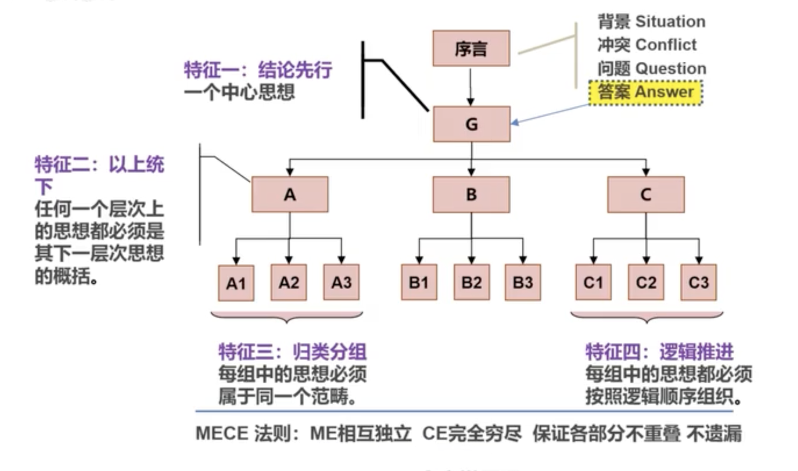

---
# **金字塔原理**
最后，对金字塔原理思想做一个整体的总结，就是：
```
一个序言：背景、冲突、问题、答案。
两个推理：基本上我们会用到归纳和演绎。
三个顺序：时间、空间和程度。
四个特征：结论先行，以上统下，归类分组和逻辑推进。
还有一个MECE法则；完全穷尽，相互独立。
```
金字塔原理已经成为了麦肯锡公司的必修课，哪怕最年轻的咨询顾问都能轻松驾驭这个工具，那是因为他们都经受过专业的训练。
金字塔原理本质上是一个思维工具，他要长期训练才能习得，不是看看听听就会了。只有深刻地理解其精髓，熟练的应用其方法，才可以真正把我灵魂。
如果再结合第一性原理、逻辑思维、思维导图、黄金思维圈、批判性思维、证伪思维，在进行组合应用，一定能领略到金字塔原理的价值和魅力，让我们的思维再次跃迁到新的高度。
