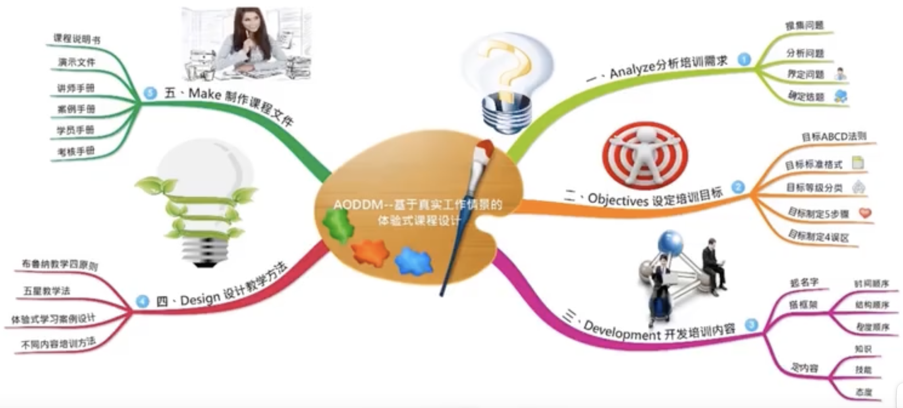

<!-- _paginate: skip -->

# 思维导图

---
# 引言
大卫赫尔在《科学与选择:生物进化与科学哲学论文集》里面提到，人类大脑遵循的原则是能不用脑就不用脑，该用脑时也不用脑；
斯坦诺维奇在《超越智商》这本书里也提到我们每一个人都是认知吝啬鬼；
从进化论的角度讲，大脑的经济性原则是为了让我们更好地生存，因为虽然大脑只有1400克，但却消耗了我们每天摄入能量的20%以上，是一个能量消耗巨大的器官，在漫长的进化过程中，人类一直处在半饥饿状态，对能量的分配是极为苛刻，人类不仅需要思考，更需要在危急时刻逃跑和搏斗，这样才能增加自己的生存力。虽然现在大多数人已经解决了温饱问题，但是大脑的经济性原理，依然影响着人类的思考。
思考最大的敌人是复杂，思维最大的障碍是混乱，在这个信息大爆炸的时代，每天铺天盖地的信息涌入大脑，繁多和无序是导致复杂和混乱的罪魁祸首。

---
# 引言
根据记忆学理论，人类大脑的记忆容量是有限的，特别是短时记忆或作工作记忆，是四加减一，信息超过一定的数量，大脑就会卡顿或停滞，如何解决这个问题呢？要么增加大脑的工作能力，要么给大脑增加一个外挂。 外挂是一个军事上的词语，是指武器系统在基本的作战单位基础之上，添加附加的，用于辅助作战单位的工具和器具。
大脑是进化的结果，目前人类的技术水平很难去改变，只能增加一个外挂，这个外挂就是思维工具。思维工具有很多种，其中思维导图是最优秀的工具之一，它是一种全脑思维工具，它就像大脑的一面镜子，把大脑内部的思维运作过程投射到外部，让思维可视化，看得见的思考。这样我们就可以化繁为简，化无序为有序，化抽象为形象，化模糊为清晰，在有限能量的情况下，全面、有序、高效地处理信息。

---
# 1 认识思维导图
## 1.1 思维导图的概念
思维导图又叫**心智导图**，是一种可视化的图像，依照人类大脑最自然的思考方式，以直观的图解方式、网络化地描述多个概念之间的关系，把各级主题的关系用相互隶属与相关的层级图表现出来，把主题关键词与图像、颜色等建立记忆链接。充分运用左右脑的机能，利用记忆、阅读、思维的规律，协助人们在科学与艺术、逻辑与想象之间平衡发展，从而开启人类大脑的无限潜能。
## 1.2 思维导图的起源
东尼•博赞，思维导图创始人，1942年生于英国伦敦，英国大脑基金会总裁，世界著名心理学家、教育学家，被誉为英国的“记忆力之父〞。他先后受聘在英国、新加坡、墨西哥、澳大利亚等各个国家的政府机构，还有迪士尼、微软、IBM、甲骨文和惠普。

---
# 1 认识思维导图
## 1.3 思维导图的历史背景

东尼.博赞的灵感来源于达芬奇和爱因斯坦。

---
# 1 认识思维导图
 &nbsp;&nbsp;
 &nbsp;&nbsp;
 &nbsp;&nbsp;

&nbsp;
&nbsp; 
&nbsp;
&nbsp;
东尼.博赞通过研究这些伟大的人物，达芬奇、爱因斯坦，还有达尔文，发现他们记笔记的方式和普通人都不一样。普通人都是线性笔记，而达芬奇、爱因斯坦这些人都是画的线条、符号、关键词，笔记的触发之下，才发明了思维导图。

---
# 1 认识思维导图
## 1.4 思维导图的价值

（1）提高学习和记忆能力
（2）提升创造性思维能力，激发右脑智能，发挥大脑创造力
（3）提升系统思维能力，增强立体思维能力和总体规划能力

总之，思维导图是我们整理思维的一个非常好的工具，我们大部分的思维是局部的、碎片的，而思维导图展现的是整体的、全景的，他可以让我们的思维系统化。

---
# 2 绘制思维导图
## 2.1 思维导图的2大底层思想

1960年末期，加州理工大学史佩利提出的**左右脑分工理论**，在1981年获得了诺贝尔医学奖。

---
# 2 绘制思维导图
左脑擅长逻辑思维，特点是逻辑、顺序；右脑擅长形象思维，特点是从整体到局部、从模糊到清晰。
思维导图是集合左右脑整体的一个思维工具，而不仅仅是一个普通的逻辑思维工具。
思维导图的2大底层思想，一个是创造性思维（发散思维），一个是结构化思维。
### 2.1.1 发散思维

**发散思维**就是**放射性思维**，是指思想从一个既定的**中心向四周放射**，是大脑自然的思维方式，和人类大脑的神经元非常相像，神经元通过联结来记忆和学习。

---
# 2 绘制思维导图
### 2.1.2 结构化思维

**结构化思维**非常重要的工具是金字塔结构，金字塔原理有四大特征：结论先行，以上统下，归类分组，逻辑推进。

---
# 2 绘制思维导图
思维导图，既可以扩散，又有逻辑。它是整合了结构化思维和发散性思维的综合性工具。
思维导图的内隐逻辑是什么？它是金字塔，也可以说金字塔原理的另一种表现形式。我们在进行内容整理的时候，要进行金字塔原理的基础规则，保证思维的逻辑性；同时在逻辑的基础之上，还要保证思维的扩散性。
分析问题需要结构化思维，寻找解决方案需要创造性思维和发散性思维，而思维导图正好整合了两种思维模式，他可以更好地帮助我们去解决问题。

---
# 2 绘制思维导图
## 2.2 思维导图的6大核心元素
在画思维导图的时候，要把握思维导图包含的六大核心元素。

第一大元素：中心图。中间要画一张图，识别度要高，这样一眼才能看清楚中心思想。
第二要有分支。分支是向外拓展的，从一点钟方向开始，顺时针去转。
第三就是要用关键词，最好不用句子。用句子的话，文字很多，看上去很不舒服。关键词一般控制在个字以内。

---
# 2 绘制思维导图
第四就是关键图。在关键的地方放一张图，一图顶千文。
第五要有颜色，颜色特别重要。心理学家朗诺.格林，他提出来利用色彩传达视觉上的信息可以提升80%的阅读意愿和参与的动机；《色彩的影响》作者怀特也认为使用色彩可以提升70%的理解力和60%的回忆能力，并缩短82%的信息搜寻时间，不同的颜色会让人产生不同的联想，具有不同的象征意义，会让人记忆更加深刻。所以在绘制思维导图的时候，一定要使用颜色，通过视觉来区分不同类别的信息，一般是主干用什么颜色，后面所有的枝干都用一样的颜色，通过颜色来表达自己的思想和情感，触发我们的想象力和记忆力，因为颜色可以触发人的联想和情感。可以根据自己的实际情况，运用不同的颜色，去表达内容背后的情感。

---
# 2 绘制思维导图

最后一个是结构。美国心理学家和教育学家，结构主义教育派代表人物布鲁纳认为任何学科知识都是具有结构的，它反映了事物之间的联系和规律性，而掌握事务的结构，我们就更容易理解它。所以表现结构图，一般有流程图、概念图、系统循环图、思维导图，每个图都有自己的特色和优势。思维导图可以帮助大脑从点状思维到逻辑思维，从逻辑思维到结构化思维，从结构化思维再到模型思维。

思维导图可以表达的结构，一般是4种逻辑关系：总分关系、并列关系、递进关系、因果关系。
所以，思维导图是有结构的，不是一堆东西堆在那里。

---
# 2 绘制思维导图
建立好结构之后，要给它上一些图片，关键的地方放张图，也不是所有的地方都放图。因为通过大量的实验证明，大脑在识别图片的时候，不仅速度快，而且准确率高，图形比词汇更具备感召力，更精确，也更便于大家去联想，从而能加强我们的创造性思维和记忆力。据统计，95%的人在记笔记的时候是不用图形的，这就是对右脑的极大浪费。画点画主要是引起注意，它是一种视觉化的强调，他可以让我们表达重点内容，让大家产生联想，同时保证图像和内容是相关、协调的，互相映衬的，追求图片和文字的平衡感。

---
# 2 绘制思维导图
## 2.3 思维导图绘制4步骤

第一步：整体布局
第二步：画中心图
第三步：建立结构
第四步：通过视觉呈现出来

---
# 3 应用思维导图
思维导图是一个思维工具，应用场景非常广泛。在《思维导图完整手册》这本书里面，东尼.博赞提到了，思维导图应用的98个领域。
其实，只要需要思考的地方，都可以用上思维导图，下面从学习、工作、生活三方面介绍一下思维导图的应用。

---
# 3 应用思维导图
## 3.1 在学习中的应用

**记录读书笔记，提升记忆能力**

## 3.1.1 记录读书笔记

我们很多人记得都是线性笔记，这种线性笔记有四大问题：

---
# 3 应用思维导图
与线性笔记相比，思维导图是有好多好处的。

思维导图是可以整理我们的思想，是做读书笔记一个非常好的工具。

---
# 3 应用思维导图
## 3.1.2 提升记忆能力

从记忆学的角度来说，记忆的基本过程是编码(识记)、保持(存储)、提取(回忆)。
编码要想编好，必须要把内容建立联系，积极创建，组织创建。
思维导图就可以完成帮助大脑编码和记忆。

---
# 3 应用思维导图
思考最大的敌人是复杂，思维最大的障碍是混乱。
那是什么导致了复杂和混乱呢？就是繁多和无序。只要事情变得繁多和无序，我们就很难记忆。

**案例：如何记住三十六计**

---
# 3 应用思维导图

我们将三十六计梳理为这样的思维导图，既有文字，又有图案，也有联系、结构、颜色，那肯定要比直接去记三十六计更加的方便，并且提取速度、记忆速度也会比较快。

---
# 3 应用思维导图
## 3.2 在工作中的应用
我们可以在各种各样的工作场景中使用思维导图：
A. 工作计划
B. 会议记录
C. 头脑风暴
D. 演讲呈现
E. SWOT分析
F. 项目管理

---
# 3 应用思维导图
### 3.2.1 工作计划

因此，工作计划的执行，除了线性结构和表结构之外，还可以用思维导图。

---
# 3 应用思维导图
### 3.2.2 会议记录

我们可以将会议概况、议事日程、行动任务很有逻辑和条理的梳理出来，可以让你纵览全局，避免拉下一些东西。再次强调，思维导图也是一个整理思维的工具。

---
# 3 应用思维导图
### 3.2.3 头脑风暴

---
# 3 应用思维导图
### 3.2.4 演讲呈现

演讲稿好几千字，很难背过的。
这是还不如做一个思维导图，只写关键字、图像、颜色，你提取出来就会比较容易。所以演讲一定要用思维导图。

---
# 3 应用思维导图
### 3.2.5 SWOT分析

---
# 3 应用思维导图
### 3.2.6 项目管理

---
# 3 应用思维导图
### 3.2.7 制作课程课件

---
# 3 应用思维导图
## 3.3 在生活中的应用
家庭事务，旅行计划，子女教育计划
以子女教育计划为例：

---
# 3 应用思维导图
思维导图是一种思维工具，可以应用到生活的方方面面，只要设计思考，都可以用上思维导图。平时，可以使用各类思维导图软件，应用起来会让工作更加高效。
思维导图，是一个全脑思维工具，如果能够结合金字塔原理，第一性原理，逻辑思维，就可以产生一加一大于二的效果。
金字塔原理保证了一个内隐的逻辑，思维导图是把内隐的逻辑视觉化，植入了创造性的元素，是对逻辑思维和创造性思维的一个完美融合。所以说，思维导图两大底层思想就是一个发散性思维和结构化思维。

---
# 3 应用思维导图
同时，大家在制作思维导图的时候，要避免一下误区：
（1）只注重结构，没有图片和颜色。 这种严格上说只是结构图，不是思维导图，只有骨架，没有血肉是不行的。
（2）只注重画画，花费大量的时间，一味追求画的漂亮与美观，忽视了结构和内容的逻辑，缺少内涵，徒有其表是不行的。
所以思维导图，既要有稳定的骨架，又要有丰满的肌肉和漂亮的外表，才是真真意义上的思维导图，才能发挥思维导图真正的魅力和价值，才能整合结构化思维和创造性思维。
