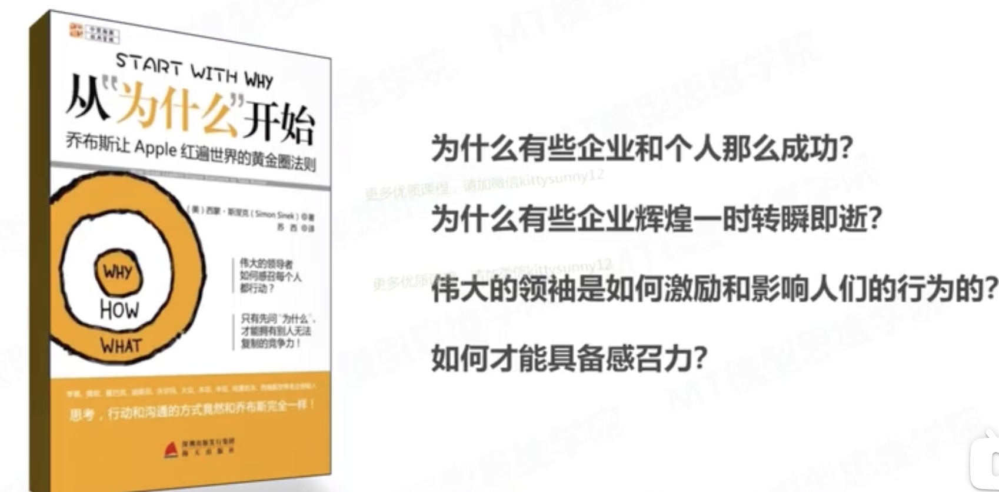
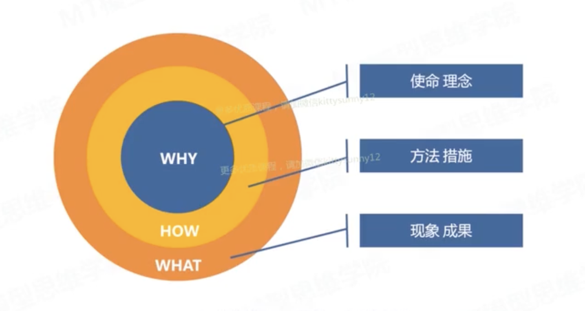
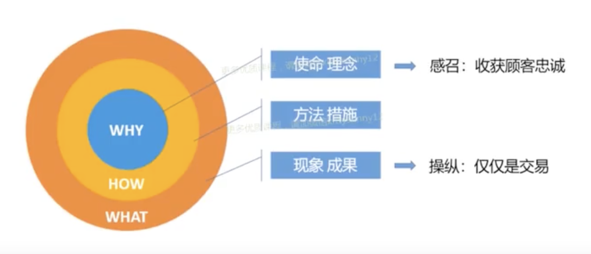
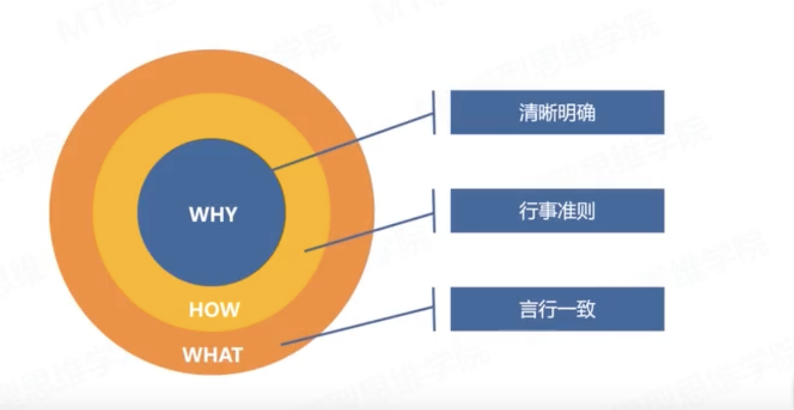
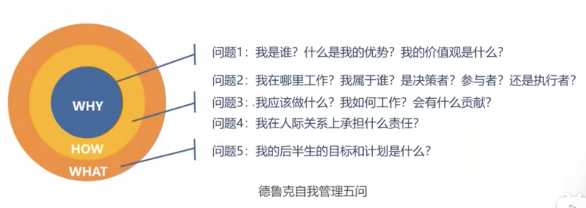
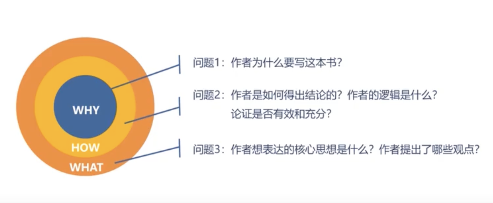

<!-- _paginate: skip -->

# 黄金圈思维

---
# 引言
在《教父》电影里，马龙.白兰度说：“那些花半秒钟就看透事物本质的人，和花一辈子都看不清事物本质的人，注定是截然不同的命运。”

史蒂夫.乔布斯说过：只有看清世界本质的人，才有可能去改变世界！

那如何才能看清事务的本质呢？如何比别人看事务更深一个层级和层次呢？黄金思维圈法则可以帮助我们看问题更深刻一点。

---
# 引言
**黄金圈思维的提出**

西蒙.斯涅克是Sinek Partners营销顾问公司创办人，是国际知名广告专业人士。他发现了一个非常简单、却非常有威力的黄金圈法则。这个法则可以帮助我们洞悉事物的本质。
黄金圈法则其实就是What-Why—How，只使用了黄金圈这个名字，一下子上黄金圈思维法则火起来了，他是我们洞察事物本质的一个非常重要的工具。
西蒙.斯涅克还专门写了一本书《从“为什么”开始：乔布斯让Apple红遍世界的黄金圈法则》

---
# 1 什么是黄金圈法则

黄金圈是一个同心圆或同心圈，从内到外依次是WHY，HOW，WHAT，分别对应不同的层次。
黄金圈分三个层次，有些人思考仅仅停留在现象层面，有些人思考他能到How方法层面，有些人思考就已经触及底层了，从最底层的WHY去思考问题。只有把握住WHY这个层级，才可能把握住真正的本质。
黄金圈倡导的思维，是先从Why开始，在思考How，最后思考What。

---
# 1 什么是黄金圈法则
**乔布斯Apple案例**
苹果为什么伟大？就是因为创始人有非常伟大的核心理念和核心精神。乔布斯说过：活着就是为了改变世界。创办苹果就是乔布斯改变世界的方式。苹果手机是改变世界的一个具体产品。苹果产品的灵魂是什么呢？就是“Think different”。只要灵魂存在，企业就可以持续不断的创新和发展。在灵魂的引领之下，苹果手机做到了极致。

从黄金圈法则来看，苹果公司为什么这么厉害？其实它就厉害在Why上面，即使乔布斯精神。在企业家精神的引领之下，第二步就是思考How，怎么实现企业所创造的核心理念呢？苹果创办了全世界最强大的供应链管理系统，高效地管理着全球800多家供应商，在营销和服务领域也做到了极致，比如体验店里有很多非常专业的设计。最后呈现在用户前面的就是What，IPhone产品。产品和服务好不好，就取决于Why和How，每个环节都做到了极致，才能做出优质产品。

---
# 1 什么是黄金圈法则
**黄金圈名字的由来** 
黄金思维圈这个名字，受到了黄金分割的启发。自古以来，黄金分割，这个简单的数学比例引得数学家、生物学家、建筑师、艺术家、音乐家和自然主义者心醉神迷。从埃及人到毕达哥拉斯，再到达•芬奇，都对它进行了深入的研究。
这个名字好听，好记，好传播，因为起名“黄金思维圈”。

---
# 2 为什么要用黄金圈

## 2.1 黄金圈思维的两个理念
为什么要用黄金思维圈去思考问题呢？他底层的法则是什么呢？
黄金思维圈里面提到了两个理念：
一个是操纵。操作就是交易。一个是感召。感召就是感化，收获顾客的忠诚。
站在黄金圈思维，从外层的交易，产品卖给用户就完成了一个交易；我们从最里面使命和理念的角度来说，是一种感召，心灵召唤。

---
# 2 为什么要用黄金圈
拿破仑说过：“征服世界有两种方式，一个靠利剑，一个靠信仰”。短时间之内，立减可以战胜信仰，但长期来看，一定是信仰战胜利剑。同理，感召是非常重要的一环。

在商业领域，靠感召获得的顾客，往往是长久地，如果仅仅靠交易、靠打折获得的顾客，仅仅是一个交易而已。操纵的是交易，感召的是灵魂。 
这里操纵是一个中心词，不是一个贬义词，操纵的方式包括：威逼利诱、鼓励表扬、罚款惩罚、从众心理、恐惧心理、权威效应等等。
感召是一种精神的召唤，是思想和理念的认同，是一种模因，是一种信仰。

---
# 2 为什么要用黄金圈
## 2.2 黄金圈思维的思考方式
只停留在表面思考问题，采用操纵的方式，只能带来交易和短期收益，无法赢得别人的忠诚和信任。而黄金圈法则提倡从内到外的思考方式，用感召去吸引和自己有相同内在动机的人，带来的是信任，带来的是聚集相同信仰的人，是内心的召唤。

## 2.3 为什么黄金圈思维（WHY）可以感召别人呢？
**从社会学角度看**：人类有一个基本的需求就是渴望**归属感**。无论哪种文化，无论是谁，都有这种向往。当身边的人跟我们有**共同的价值观和信念**的时候，我们就会产生归属感，找到了归属感，就能体会被认同的感觉，也会觉得安全。身为人类，我们渴望这种情感，并会**主动去寻找它**。

---
# 2 为什么要用黄金圈
**从生物学角度看**：人类的大脑系统分为边缘系统和新皮层，边缘系统主要负责情感，比如信任、忠诚，他也负责我们所有的行为决策，但是它没有语言能力。最外面的新皮层也叫新皮质，它负责理性思维、分析和语言。当我们从外到内做沟通的时候，也就是做什么的时候，我们能够理解大量的复杂信息，比如说事实、特征，可是不会让我们采取行动。当我们要从内往外沟通的时候，我们就是直接对着控制决策过程的脑区在说话。

乔布斯在感召百事可乐副总裁斯卡利的时候说：“你是想卖一辈子糖水呢，还是想跟着我改变世界呢”。这句话不是很理性，非常感性，它是直接对着斯卡利的边缘脑，点燃了他心中的那把火，控制情感的边缘脑没有语言能力，正是这种断裂，让我么很难用语言去表达情感，有时候我们很难明白，有些人做一些选择没有原因和理由的，就是一种内心的选择。可见边缘脑的威力非常大，控制着我们的情感和直觉，让我们可能做出一个非常不合逻辑和不理智的事情来。

---
# 3 黄金圈法则的应用
## 3.1 企业经营中的应用

Why是信念，作为一个领导者，你一定要清晰地表述出来为什么要做这家企业。
How就是行事准则，落实理念的行为，怎样把我们的理念转换成现实，转化成实际的目标和行动计划。
What是行为的结果，是与客户的连接，是向客户传递信念的载体。如果你的言行一致，人们就相信你的理念和信念，他才可以建立忠诚度。反之，则会怀疑。
Why就是清晰明确为什么要做这件事；How就是行为准则，如何做这件事；What就是要保证思想和行为、产品是完全一致的。这就是一个管理者要思考的问题。

---
# 3 黄金圈法则的应用

在企业经营过程中，我们可以运用德鲁克的五问去对照一下自己的企业，德鲁克的五问正好是能和黄金思维圈能一一对上的。

---
# 3 黄金圈法则的应用
**优秀领导者的三件事**
第一、清晰使命，建立愿景，树立感召的力量。
第二、设定目标，寻找实现目标的方法。
第三、激励他人，建立信任机制，创造可实现信念的环境去吸引优秀人才的加入。

对于Why有清晰理解的公司，能够唤起员工的激情，员工会更高产创新。所以建立优秀的企业文化，是企业家必须思考的问题，企业文化也是Why的载体。 否则，企业文化发展不上去，创始人离员工越来越远，员工和公司之间就是一种交易，工作就失去了意义，只为赚钱，不能和企业共苦。

---
# 3 黄金圈法则的应用
## 3.1 个人成长中的应用
人生的意义是什么？这既是一个哲学问题，也是一个现实问题。
苏格拉底说，没有思考过的人生是不值得活的；亚里士多德说，人生的终极目标是获得幸福；而幸福是什么呢？积极心理学赛格利曼认为，有意义的人生才是幸福的人生，有意义的人生就是拥有Why的人生。

---
# 3 黄金圈法则的应用

那我们如何寻找人生的意义呢？在这里，可以用德鲁克先生提出的自我管理的五个问题问问自己。

---
# 3 黄金圈法则的应用
## 3.3 学习中的应用

学习有很多种，其中看书是一种非常重要的方式。那如何看书呢，我们不能只停留在What的层面，还要多想想How和Why。
拿起一本书的时候，可以从如下三个问题想想。

---
# 3 黄金圈法则的应用
黄金思维圈是一个非常通用和广泛的思维工具，我们现在所有的科学发现就是使用黄金圈不断拷问的过程。这个思维工具可以应用到政治、经济、文化、生活各个方面，从提出问题到解决问题，再到提出新的问题，推动者社会的不断向前。
在使用黄金圈的过程中间，我们还要结合其他工具组合使用，再加上5 Why分析法、德鲁克五问或金字塔原理、PRV组织能力分析模型，特别是5 Why分析法这些组合在一起就非常有价值。
黄金圈法则使我们理解世界的一个工具，可以帮助我们更好地认知这个世界，寻找世界的真相。其中Why是核心。

